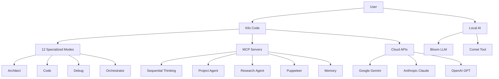

# AI Software Stack Assessment

**Generated:** 2026-01-11  
**Purpose:** Complete inventory and optimization analysis

---

## Executive Summary

Your AI stack consists of **5 active MCP servers**, **3+ cloud API providers**, **Kilo Code** with 10 specialized modes, and **2 local AI applications** (Bloom & Comet). You have a sophisticated, multi-layered setup that balances local and cloud resources.

---

## 1. Local AI Applications

### Installed Applications

| Application | Version | Status | Type |
|-------------|---------|--------|------|
| **Bloom** | v1.5.18 | ✅ Installed & Running | Local LLM Runner |
| **Comet** | Latest | ✅ Installed & Running | AI Tool (needs clarification) |
| **Obsidian** | 1.10.6 | ✅ Installed | Knowledge Management |
| **Notion** | 6.3.1 | ✅ Installed | Knowledge Management |

### Questions Needed
- **Bloom Models**: Which local LLM models are installed? (Llama 3, Mistral, Qwen, etc.)
- **Comet Purpose**: What is Comet used for? (Local LLM, image generation, other?)
- **Model Storage**: Where are models stored and what's the disk usage?

---

## 2. Kilo Code Configuration

### Active AI Assistant
- **Primary Model**: Claude Sonnet 4.5
- **Provider**: Anthropic
- **Integration**: Direct API

### Specialized Modes (10 Total)

| Mode | Slug | Purpose | Primary Use Case |
|------|------|---------|------------------|
| **Architect** | `architect` | Planning & design | Task breakdown, architecture |
| **Code** | `code` | Implementation | Writing/modifying code |
| **Ask** | `ask` | Q&A | Explanations, documentation |
| **Debug** | `debug` | Troubleshooting | Error investigation |
| **Orchestrator** | `orchestrator` | Multi-step projects | Complex workflows |
| **Code Reviewer** | `code-reviewer` | Quality assurance | Code reviews |
| **Code Simplifier** | `code-simplifier` | Refactoring | Code clarity |
| **Code Skeptic** | `code-skeptic` | Critical analysis | Quality inspection |
| **Documentation Specialist** | `docs-specialist` | Technical writing | Documentation |
| **Frontend Specialist** | `frontend-specialist` | UI/UX | React, TypeScript, CSS |
| **Test Engineer** | `test-engineer` | Testing | Test coverage, QA |
| **UI GNUU** | `ui-gnuu` | UI opportunities | Interface optimization |

### Mode Restrictions
- Some modes have file editing restrictions (e.g., Architect can only edit `\.md$`)
- Modes optimized for specific tasks to maintain focus

---

## 3. MCP Server Integrations

### Active MCP Servers (5)

#### 1. **Sequential Thinking** 
```bash
npx -y @modelcontextprotocol/server-sequential-thinking
```
- **Purpose**: Advanced reasoning, chain-of-thought problem solving
- **Key Tool**: Dynamic step-by-step analysis
- **Use Case**: Complex problem decomposition, hypothesis generation
- **Status**: ✅ Active

#### 2. **Project Agent**
```bash
node /Users/ewanbramley/Documents/Kilo-Code/MCP/project-agent-server/build/index.js
```
- **Purpose**: Project management and task execution
- **Tools**:
  - `run_project_command` - Execute commands in project directory
  - `analyze_project` - Project structure analysis
  - `manage_project_tasks` - Task CRUD operations
- **Use Case**: Project automation, task tracking
- **Status**: ✅ Active

#### 3. **Research Agent**
```bash
node /Users/ewanbramley/Documents/Kilo-Code/MCP/research-agent/build/index.js
```
- **Purpose**: Market validation and platform research
- **Tools**:
  - `validate_quick_filter` - Fast product idea validation
  - `validate_deep_scoring` - Detailed market analysis
  - `research_platform_data` - Platform-specific research
- **Platforms**: Etsy, Gumroad, Creative Market, Amazon KDP, eBay
- **Use Case**: Product research, market validation
- **Status**: ✅ Active

#### 4. **Puppeteer**
```bash
npx -y @modelcontextprotocol/server-puppeteer
```
- **Purpose**: Headless browser automation
- **Tools**:
  - `puppeteer_navigate` - Web navigation
  - `puppeteer_screenshot` - Screenshots
  - `puppeteer_click` - Element interaction
  - `puppeteer_fill` - Form filling
  - `puppeteer_evaluate` - JavaScript execution
- **Resources**: `console://logs` - Browser console access
- **Use Case**: Web scraping, testing, automation
- **Status**: ✅ Active

#### 5. **Memory**
```bash
npx -y @modelcontextprotocol/server-memory
```
- **Purpose**: Knowledge graph management
- **Tools**:
  - `create_entities` - Add knowledge nodes
  - `create_relations` - Link entities
  - `add_observations` - Context enrichment
  - `search_nodes` - Semantic search
  - `read_graph` - Full graph access
- **Use Case**: Long-term memory, context persistence
- **Status**: ✅ Active

---

## 4. Cloud API Services

### Confirmed Integrations

| Provider | Service | Configuration | Status |
|----------|---------|---------------|--------|
| **Google** | Gemini API | ✅ Configured | Active |
| **Anthropic** | Claude API | ✅ (Kilo Code) | Active |
| **OpenAI** | GPT Models | ⚠️ Mentioned | Needs verification |

### Gemini Setup
- **Config Location**: `agentic_workflow/.env`
- **Dependencies**: `google-generativeai` (Python)
- **Features**:
  - Autonomous workflows
  - Semi-autonomous mode
  - Cloud-safe PII redaction
  - Retry logic (3 attempts)

### OpenAI & Anthropic
- **Status**: User reported as "using" but API keys not found in scanned files
- **Action Required**: Verify active usage and key location

---

## 5. Python AI Dependencies

### From `agentic_workflow/requirements.txt`

```
google-generativeai    # Gemini integration
fastapi==0.109.0      # API framework
uvicorn[standard]==0.27.0  # ASGI server
pydantic==2.5.0       # Data validation
python-dotenv         # Environment management
cryptography          # Security/encryption
pytest                # Testing
python-multipart==0.0.6  # File uploads
```

### Key Projects

#### Agentic Workflow
- **Purpose**: Multi-agent orchestration
- **Agents**: Librarian, Policy, Task
- **Features**:
  - Autonomous workflows
  - Policy-based decisions
  - Audit logging
  - Security layers

---

## 6. AI Ecosystem Map



---

## 7. Optimization Opportunities

### 🔴 High Priority

1. **API Key Audit**
   - **Issue**: OpenAI and Anthropic keys not found in scanned configs
   - **Action**: Locate and document all API key locations
   - **Risk**: Untracked costs, security exposure

2. **Bloom Model Inventory**
   - **Issue**: Unknown which models are installed
   - **Action**: List models, sizes, and usage patterns
   - **Impact**: Storage optimization, performance tuning

3. **Comet Identification**
   - **Issue**: Purpose unclear (could be duplicate of Bloom)
   - **Action**: Clarify Comet's role in your workflow
   - **Opportunity**: Eliminate redundancy

### 🟡 Medium Priority

4. **MCP Server Consolidation**
   - **Observation**: 5 active servers with some potential overlap
   - **Review**:
     - Project Agent vs manual task tracking
     - Puppeteer vs manual browser automation
   - **Action**: Evaluate actual usage frequency

5. **Knowledge Management Duplication**
   - **Tools**: Memory MCP + Obsidian + Notion
   - **Question**: Are all three necessary?
   - **Action**: Define clear use cases for each

6. **Cost Tracking**
   - **Issue**: No visibility into API usage costs
   - **Action**: Implement cost monitoring for:
     - Claude (Kilo Code primary)
     - Gemini (agentic workflow)
     - OpenAI (if active)

### 🟢 Low Priority

7. **Environment Configuration**
   - **Observation**: `.env` files scattered across projects
   - **Action**: Centralize secrets management
   - **Benefit**: Easier rotation, better security

8. **Python Dependency Updates**
   - **Status**: Some packages pinned to older versions
   - **Action**: Review for security updates
   - **Example**: FastAPI 0.109.0 → latest stable

---

## 8. Cost Analysis (Estimated)

### Monthly Costs (Approximate)

| Service | Tier | Est. Monthly Cost | Notes |
|---------|------|-------------------|-------|
| **Anthropic Claude** | API | $50-500+ | Depends on Kilo Code usage |
| **Google Gemini** | API | $0-50 | Agentic workflow usage |
| **OpenAI** | API | $?? | Need confirmation |
| **MCP Servers** | npx/local | $0 | Open source, self-hosted |
| **Local Models** | N/A | $0 | One-time download |
| **Total** | | **$50-550+** | Wide range due to unknowns |

### Cost Optimization Strategies

1. **Set API Budgets**: Configure monthly spending limits
2. **Use Local First**: Leverage Bloom for routine tasks
3. **Cache Results**: Implement response caching
4. **Batch Requests**: Group similar API calls
5. **Monitor Usage**: Track per-mode API consumption

---

## 9. Security & Best Practices

### ✅ Currently Implemented

- ✅ `.env` files for secrets (not committed to git)
- ✅ `.gitignore` protects sensitive files
- ✅ PII redaction in cloud mode
- ✅ Audit logging in agentic workflow
- ✅ Encrypted storage (cryptography library)

### ⚠️ Recommendations

1. **API Key Rotation**: No evidence of regular rotation schedule
2. **Centralized Secrets**: Consider using a secrets manager
3. **Access Logging**: Track which modes use which APIs
4. **Rate Limiting**: Implement per-mode request limits
5. **Backup Keys**: Store encrypted backups securely

---

## 10. Recommendations Summary

### Immediate Actions

1. **Document OpenAI/Anthropic Keys**
   - Where are they stored?
   - What's the monthly spend?
   - Which tools use them?

2. **Bloom Model Audit**
   - Run: `bloom models list` (or equivalent)
   - Document sizes and purposes
   - Remove unused models

3. **Clarify Comet Usage**
   - What does it do?
   - Is it redundant with Bloom?
   - Keep or remove?

### Short-Term (This Week)

4. **Enable Cost Tracking**
   - Add API usage monitoring
   - Set budget alerts
   - Review monthly

5. **Test MCP Servers**
   - Verify all 5 servers still needed
   - Document actual usage
   - Disable unused servers

6. **Consolidate Knowledge**
   - Define: Memory vs Obsidian vs Notion
   - Create clear workflows
   - Reduce duplication

### Long-Term (This Month)

7. **Optimize Local/Cloud Balance**
   - Use local models for routine tasks
   - Reserve cloud APIs for complex reasoning
   - Track cost savings

8. **Implement Caching**
   - Cache frequent API responses
   - Reduce redundant calls
   - Measure impact

9. **Security Hardening**
   - Set up key rotation schedule
   - Centralize secrets management
   - Add access controls

---

## 11. Questions for You

To complete this assessment, please provide:

1. **Bloom**:
   - Which models are installed?
   - How often do you use it vs cloud APIs?
   - What's the disk usage?

2. **Comet**:
   - What is this tool used for?
   - Is it different from Bloom?
   - How often do you use it?

3. **APIs**:
   - Where are OpenAI/Anthropic keys stored?
   - What's your typical monthly spend?
   - Which specific models do you use?

4. **Usage Patterns**:
   - Which Kilo Code modes do you use most?
   - Which MCP servers provide the most value?
   - Any tools you've stopped using?

5. **Goals**:
   - Primary goal: Cost reduction or performance?
   - Willing to switch providers for savings?
   - Keep local models or go fully cloud?

---

## 12. Next Steps

Based on your answers, I'll create:

1. **Detailed Optimization Plan**
   - Specific cost reduction strategies
   - Performance improvements
   - Redundancy elimination

2. **Implementation Checklist**
   - Step-by-step actions
   - No estimates, just clear steps
   - Prioritized by impact

3. **Monitoring Dashboard**
   - API usage tracking
   - Cost visibility
   - Performance metrics

---

## Appendix: Tool Inventory

### Quick Reference

**Local AI**: Bloom, Comet  
**Cloud APIs**: Claude, Gemini, (OpenAI?)  
**MCP Servers**: 5 active  
**Kilo Modes**: 12 specialized  
**Knowledge Tools**: Memory, Obsidian, Notion  
**Python AI Libs**: google-generativeai, fastapi

**Total Tool Count**: 20+ AI-related tools/services