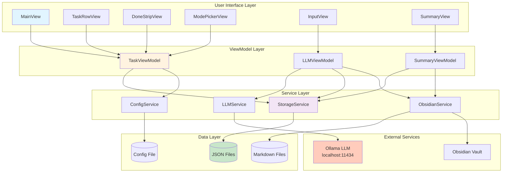
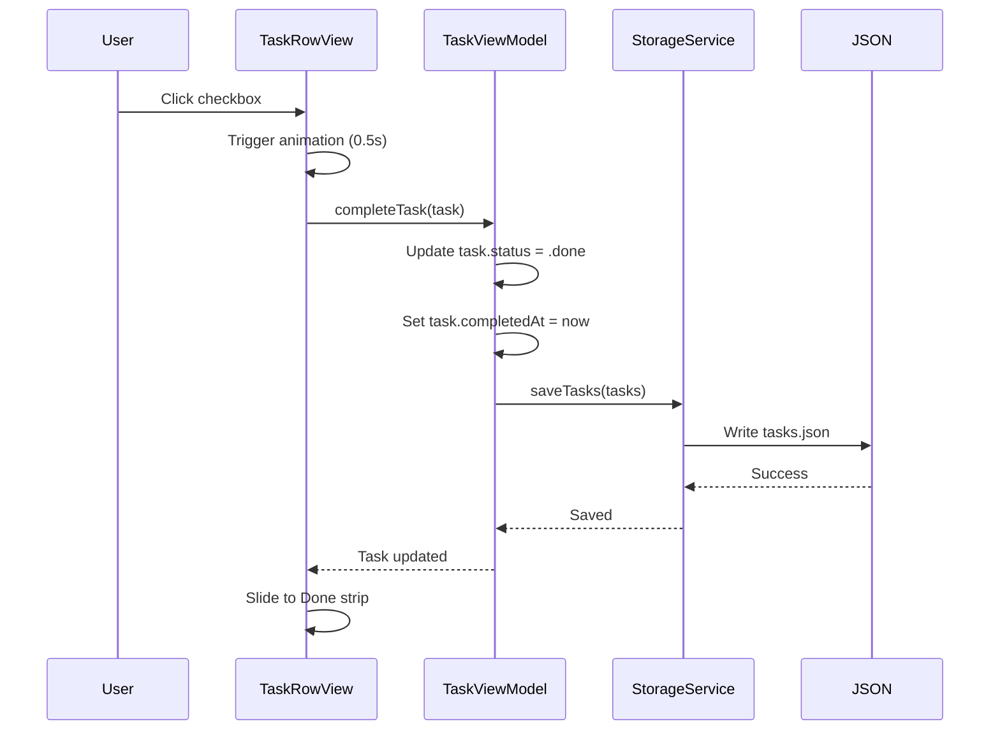
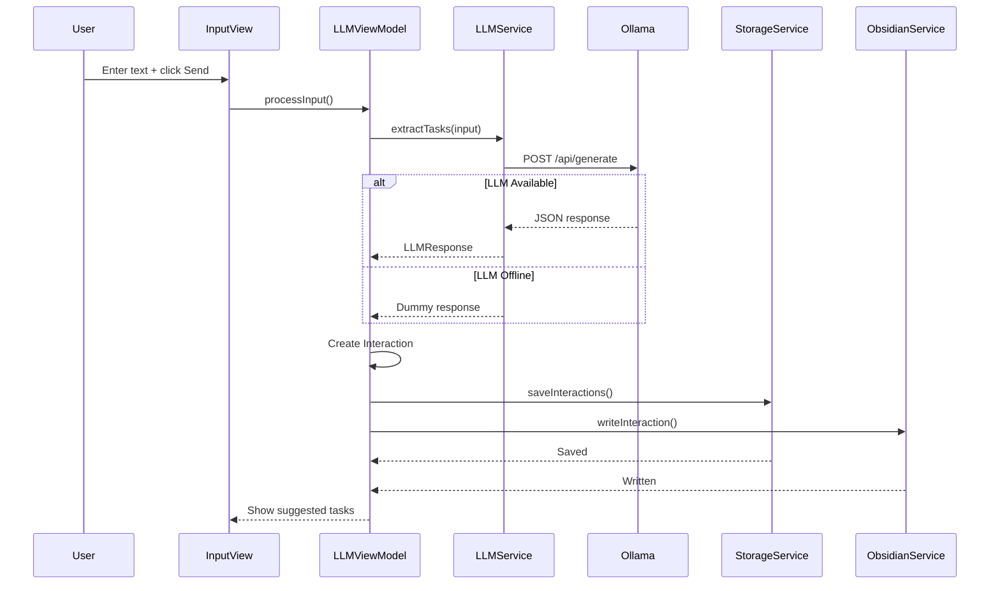
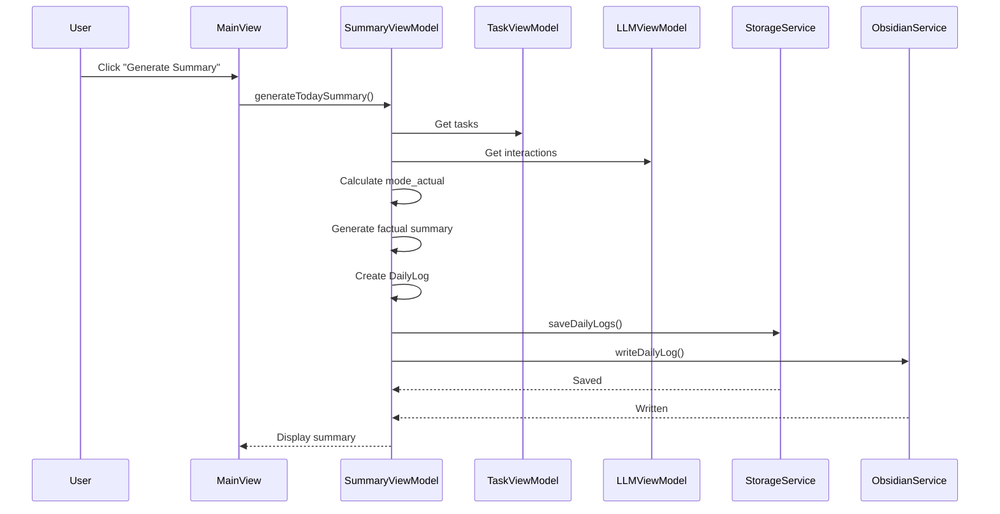
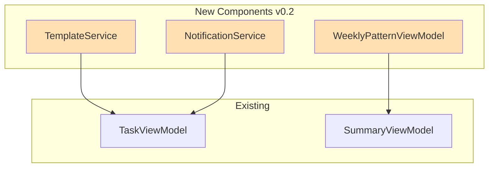

# Today Mirror - Architecture Overview

**Version:** 0.1  
**Tech Stack:** SwiftUI Native macOS App  
**Date:** 2024-12-16

---

## System Architecture



---

## Data Flow Diagrams

### 1. Task Completion Flow



### 2. LLM Interaction Flow



### 3. Daily Summary Generation Flow



---

## Component Relationships

### Models
```
Task
├── id: UUID
├── title: String
├── lane: TaskLane (revenue/delivery/life)
├── status: TaskStatus (intended/done/archived)
├── createdAt: Date
├── completedAt: Date?
├── archivedAt: Date?
└── source: TaskSource (manual/llmSuggested)

Interaction
├── id: UUID
├── timestamp: Date
├── userInput: String
├── llmResponse: LLMResponse
├── actionTaken: InteractionAction
└── notes: String?

DailyLog
├── date: String (YYYY-MM-DD)
├── modeSet: AppMode
├── modeActual: String
├── tasksCommitted: [Task]
├── tasksCompleted: [Task]
├── tasksArchived: [Task]
├── interactions: [Interaction]
├── summaryText: String
└── patternNotes: String?
```

### ViewModels (ObservableObject)
```
TaskViewModel
├── @Published tasks: [Task]
├── @Published currentMode: AppMode
├── @Published errorMessage: String?
├── intendedTasks: [Task] (computed)
├── doneTasks: [Task] (computed)
├── addTask()
├── completeTask()
├── archiveTask()
└── changeMode()

LLMViewModel
├── @Published userInput: String
├── @Published isProcessing: Bool
├── @Published suggestedTasks: [SuggestedTask]
├── @Published errorMessage: String?
├── @Published interactions: [Interaction]
├── processInput() async
└── clearSuggestions()

SummaryViewModel
├── @Published dailyLogs: [DailyLog]
├── @Published currentSummary: String?
├── @Published isGenerating: Bool
└── generateTodaySummary()
```

### Services (Singleton)
```
StorageService
├── dataDirectory: URL (~/.today-mirror/data/)
├── loadTasks() -> [Task]
├── saveTasks([Task])
├── loadInteractions() -> [Interaction]
├── saveInteractions([Interaction])
├── loadDailyLogs() -> [DailyLog]
└── saveDailyLogs([DailyLog])

ObsidianService
├── vaultPath: URL?
├── setVaultPath(String)
├── writeInteraction(Interaction)
└── writeDailyLog(DailyLog)

LLMService
├── endpoint: URL
├── model: String
├── extractTasks(String) async -> Result<LLMResponse, Error>
└── dummyResponse(String) -> LLMResponse

ConfigService
├── configURL: URL (~/.today-mirror/config.json)
├── loadConfig() -> AppConfig?
└── saveConfig(AppConfig)
```

---

## File System Structure

```
~/.today-mirror/
├── config.json                    # App configuration
└── data/
    ├── tasks.json                 # All tasks
    ├── interactions.json          # All LLM interactions
    └── daily_logs.json            # All daily summaries

~/Documents/Obsidian/TodayMirror/  # User-configured vault path
├── interactions/
│   └── 2024-12-16T14-30-00Z.md   # One file per interaction
├── daily_logs/
│   └── 2024-12-16.md             # One file per day
└── weekly_patterns/
    └── 2024-W50.md               # One file per week (v0.2)
```

---

## Mode Rules Matrix

| Mode | Revenue Slots | Delivery Slots | Life Slots | Total |
|------|--------------|----------------|------------|-------|
| Money-First | 2 (66%) | 1 (33%) | 0 (0%) | 3 |
| Balance | 1 (33%) | 1 (33%) | 1 (33%) | 3 |
| Recovery | 0 (0%) | 1 (33%) | 2 (66%) | 3 |

**Enforcement:**
- When adding a task, check `currentMode.maxTasksForLane(lane)`
- If lane is full, show error: "Cannot add more {lane} tasks in {mode} mode"
- If 3 tasks already exist, show error: "Today is full. Replace or archive a task first"

---

## State Management

### SwiftUI Environment Objects
```swift
@main
struct TodayMirrorApp: App {
    @StateObject private var taskVM = TaskViewModel()
    @StateObject private var llmVM = LLMViewModel()
    @StateObject private var summaryVM = SummaryViewModel()
    
    var body: some Scene {
        WindowGroup {
            MainView()
                .environmentObject(taskVM)
                .environmentObject(llmVM)
                .environmentObject(summaryVM)
        }
    }
}
```

**Benefits:**
- Single source of truth for each domain
- Automatic UI updates via `@Published`
- Shared state across all views
- No prop drilling

---

## Error Handling Strategy

### Levels
1. **Silent Recovery:** LLM offline → use dummy response
2. **User Notification:** Mode validation errors → show alert
3. **Logging:** All errors logged to console
4. **Graceful Degradation:** Missing config → use defaults

### Examples
```swift
// Silent recovery
let result = await llmService.extractTasks(from: input)
switch result {
case .success(let response):
    // Use real response
case .failure:
    // Use dummy response, log error
}

// User notification
if intendedTasks.count >= 3 {
    errorMessage = "Today is full. Replace or archive a task first."
    // Alert shown via .alert() modifier
}

// Graceful degradation
let config = ConfigService.shared.loadConfig() ?? .default
```

---

## Performance Considerations

### Optimization Strategies
1. **Lazy Loading:** Load tasks/interactions on demand
2. **Debouncing:** LLM input debounced by 500ms
3. **Background Processing:** LLM calls on background thread
4. **Efficient Rendering:** SwiftUI automatic optimization
5. **Small Data Sets:** Max 3 intended tasks, limited history

### Expected Performance
- **App Launch:** <1s
- **Task Addition:** <100ms
- **Task Completion:** <100ms (animation: 500ms)
- **LLM Call:** 2-5s (local model)
- **JSON Save:** <50ms
- **Markdown Write:** <100ms

---

## Security & Privacy

### Data Protection
- **Local-Only:** All data stays on user's machine
- **No Cloud:** No data sent to external services (except local LLM)
- **File Permissions:** Standard macOS file permissions
- **No Encryption:** Not needed (local files, trusted user)

### LLM Privacy
- **Local Model:** Ollama runs on localhost
- **No Telemetry:** No usage data sent anywhere
- **User Control:** User can disable LLM entirely

---

## Testing Strategy

### Unit Tests
- **Models:** Test data structures and logic
- **ViewModels:** Test business logic and state changes
- **Services:** Test file I/O and LLM client

### Integration Tests
- **Storage:** Test JSON read/write cycle
- **Obsidian:** Test markdown generation
- **LLM:** Test with mock responses

### Manual Tests
- **UI:** Test all user interactions
- **Animations:** Verify micro-win smoothness
- **Mode Rules:** Verify lane validation
- **Error Handling:** Test offline LLM, full tasks, etc.

### Smoke Test
- Automated script that verifies:
  - App builds
  - App launches
  - Files created
  - Basic operations work

---

## Deployment

### Build Configuration
- **Target:** macOS 13.0+
- **Architecture:** Universal (Intel + Apple Silicon)
- **Signing:** Developer ID (for distribution)
- **Notarization:** Required for Gatekeeper

### Distribution Options
1. **Direct Download:** DMG file
2. **Homebrew Cask:** `brew install --cask today-mirror`
3. **Mac App Store:** (requires Apple Developer Program)

### Installation Steps
1. Download DMG
2. Drag to Applications
3. First launch: Right-click → Open (Gatekeeper)
4. Configure Obsidian path (optional)
5. Start using

---

## Future Architecture (v0.2+)

### Planned Additions


### Potential Features
- **Weekly Patterns:** Full aggregation and insights
- **Task Templates:** Common task presets
- **Notifications:** Reminders (opt-in)
- **Keyboard Shortcuts:** Power-user features
- **Settings UI:** Configuration panel
- **Export:** CSV/JSON export
- **Backup/Restore:** Data management

---

## Constraints & Trade-offs

### Architectural Decisions

**Decision:** SwiftUI over Web App  
**Trade-off:** Mac-only vs faster development  
**Rationale:** Better UX, native feel, smaller footprint

**Decision:** JSON files over Database  
**Trade-off:** Simplicity vs scalability  
**Rationale:** Small data sets, human-readable, easy backup

**Decision:** Singleton Services  
**Trade-off:** Global state vs dependency injection  
**Rationale:** Simple app, no multi-user, easier to use

**Decision:** Local LLM only  
**Trade-off:** Privacy vs accuracy  
**Rationale:** Core principle, user control, cost savings

**Decision:** 3-task hard limit  
**Trade-off:** Flexibility vs focus  
**Rationale:** Behavioral science, prevent overload

---

## Glossary

- **Lane:** Category of task (revenue, delivery, life)
- **Mode:** Behavioral framework with lane allocation rules
- **Intended:** Tasks in left column (Today's 3)
- **Done:** Tasks in right column (completed today)
- **Micro-win:** Subtle visual feedback on completion
- **Interaction:** User input + LLM response pair
- **Daily Log:** End-of-day factual summary
- **Pattern Mirror:** Weekly aggregation (v0.2)

---

**END OF ARCHITECTURE DOCUMENT**

This architecture supports the behavioral principles and technical requirements defined in SPEC.md while maintaining simplicity and focus for v0.1.