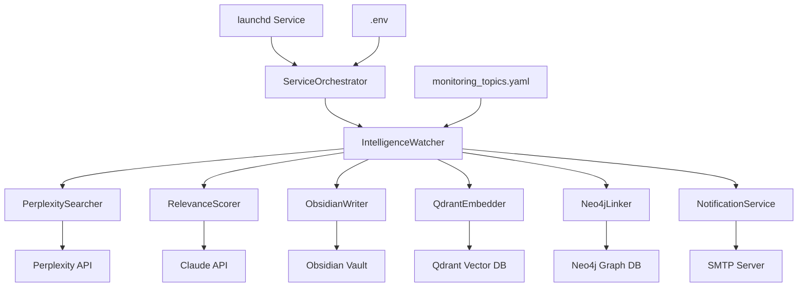

# Intelligence Monitoring System - Architecture & Implementation Plan

## Executive Summary

A 24/7 automated intelligence monitoring system for Byker Business Help AI that scans UK SMB markets, competitors, experts, and tech stacks using Perplexity API, scores results with Claude AI, and stores intelligence in Obsidian, Qdrant (vector DB), and Neo4j (knowledge graph).

**Key Features:**
- Daily automated scans at 06:00 Europe/London
- AI-powered relevance scoring (Claude)
- Multi-channel output (Obsidian notes, Qdrant vectors, Neo4j graph)
- Graceful degradation (continues on single-topic failures)
- macOS launchd integration for 24/7 operation
- Email notifications for high-priority findings

---

## System Architecture



---

## Directory Structure

```
~/principles-system/
├── config/
│   └── monitoring_topics.yaml       # Monitoring configuration
├── processors/
│   ├── __init__.py                  # Exports
│   └── relevance_scorer.py          # Claude AI scoring
├── watchers/
│   ├── __init__.py                  # Exports
│   └── intelligence_watcher.py      # Main monitoring logic
├── logs/                            # Runtime logs
├── .env                             # API keys (gitignored)
├── .env.example                     # Template
├── .gitignore                       # Security
├── requirements.txt                 # Python dependencies
├── orchestrator.py                  # Service entry point
├── run_once.sh                      # Test run script
├── start_service.sh                 # Launchd script
└── README.md                        # Setup docs
```

---

## Component Specifications

### 1. PerplexitySearcher

**Purpose:** Execute web searches using Perplexity AI

**Key Methods:**
- `search(query, time_range, max_results)` → List[Dict]

**API Configuration:**
- Model: `llama-3.1-sonar-large-128k-online`
- Rate limits: 20 req/min (free), 50 req/min (standard)
- Error handling: Exponential backoff + retries

**Output Format:**
```python
{
    "title": str,
    "url": str,
    "source": str,
    "snippet": str,
    "published_date": str
}
```

---

### 2. RelevanceScorer

**Purpose:** Score search results using Claude AI

**Scoring Dimensions:**
- `relevance` (0.0-1.0): How relevant to business goals
- `actionability` (0.0-1.0): Immediate action potential
- `strategic_value` (0.0-1.0): Long-term strategic importance

**Business Context (System Prompt):**
```
Byker Business Help AI - Newcastle-based AI consultancy
Target: UK SMBs with £0-3M annual revenue
Verticals: Dental, Vet, Salon, Gym, Trades, Professional Services
Offerings: AI phone systems, marketing automation
```

**Output Format:**
```python
@dataclass
class ScoredResult:
    title: str
    url: str
    snippet: str
    source: str
    scores: Dict[str, float]  # relevance, actionability, strategic_value
    key_insight: str
    action_items: List[str]
    related_principles: List[str]
    client_opportunities: List[str]
```

**Fallback Heuristics:**
- Keyword matching (UK SMB terms)
- Source reputation scoring
- Recency weighting

**Caching Strategy:**
- Hash content → cache scores
- 7-day TTL for cached scores

---

### 3. ObsidianWriter

**Purpose:** Create markdown notes in Obsidian vault

**Note Structure:**
```yaml
---
type: intelligence_update
topic: "UK Dental Practices"
category: "Industries"
priority: HIGH
date: 2026-01-17
tags:
  - intelligence
  - dental
  - uk-smb
---

# Intelligence Update: UK Dental Practices

## Summary
Brief overview of findings

## Key Findings
1. Finding A (relevance: 0.92, actionability: 0.85)
2. Finding B (relevance: 0.88, actionability: 0.76)
...

## Action Items
- Action 1
- Action 2

## Related Principles
- [[Principle Name]]

## Client Opportunities
- Specific client application ideas
```

**Methods:**
- `write_update(topic, scored_results)`
- `write_daily_summary(all_updates)`

---

### 4. QdrantEmbedder

**Purpose:** Store intelligence as searchable vectors

**Configuration:**
- Collection: `market_intelligence`
- Model: `text-embedding-3-small` (OpenAI)
- Host: `localhost:6333`

**Payload Structure:**
```python
{
    "title": str,
    "url": str,
    "snippet": str,
    "topic": str,
    "category": str,
    "scores": dict,
    "key_insight": str,
    "timestamp": str
}
```

---

### 5. Neo4jLinker

**Purpose:** Build knowledge graph relationships

**Node Types:**
- `IntelligenceUpdate`
- `Principle`
- `Industry`
- `Competitor`
- `Expert`
- `Technology`

**Relationships:**
- `RELATES_TO` (Update → Principle)
- `ABOUT` (Update → Industry/Competitor/etc.)
- `SUGGESTS` (Update → Action)

---

### 6. NotificationService

**Purpose:** Email alerts for high-priority intelligence

**Trigger Conditions:**
- Priority = HIGH
- Category = Industries OR Competitors
- Relevance score ≥ 0.85

**Email Template:**
```
Subject: 🚨 High-Priority Intelligence: [Topic]

[Key Insight]

Relevance: [score]
Action Items:
- [item 1]
- [item 2]

View full report: [Obsidian link]
```

---

## Configuration: monitoring_topics.yaml

### Global Settings
```yaml
monitoring:
  enabled: true
  frequency: "daily"
  run_time: "06:00"
  timezone: "Europe/London"

search_api:
  provider: "perplexity"
  model: "llama-3.1-sonar-large-128k-online"

filters:
  relevance_threshold: 0.7
```

### Topic Categories

**Industries (HIGH priority, 7d time range):**
1. UK Dental Practices
   - Keywords: UK dental automation, NHS dental regulations 2026, dental AI UK
2. UK Veterinary Practices
   - Keywords: UK vet automation, RCVS regulations
3. UK Hairdressing/Beauty Salons
4. UK Gyms/Fitness
5. UK Trades (plumbers, electricians, builders)
6. UK Professional Services (accountants, solicitors)

**Competitors (HIGH priority, 7d time range):**
1. UK SMB AI Consultancies
2. Voice AI Providers (AI phone systems UK, AI receptionist)
3. Marketing Automation Agencies

**Experts (MEDIUM priority, 7d time range):**
1. Dan Kennedy (direct response marketing)
2. Paddi Lund (happiness business)
3. Zig Ziglar (sales philosophy)

**Tech Stack (MEDIUM priority, 14d time range):**
1. Neo4j
2. Qdrant
3. Claude AI
4. Voice AI technology

**Regional (MEDIUM priority, 3d time range):**
1. Newcastle & North East Business news

---

## Error Handling & Resilience

### Failure Modes
1. **Single Topic Failure** → Log error, continue to next topic
2. **API Rate Limit** → Exponential backoff, resume later
3. **Qdrant/Neo4j Unavailable** → Skip optional storage, continue with Obsidian
4. **SMTP Failure** → Log error, do not block pipeline

### Logging Strategy
```python
# Structured logging
logging.info("🔍 Scanning topic: UK Dental Practices")
logging.warning("⚠️  Qdrant unavailable, skipping vector storage")
logging.error("❌ Perplexity API error: Rate limit exceeded")
logging.success("✅ Scan complete: 12/12 topics processed")
```

---

## Security & API Keys

### Required Credentials
1. **PERPLEXITY_API_KEY** (🚨 User must regenerate - exposed key)
2. **ANTHROPIC_API_KEY** (check ~/.claude.json or user-provided)
3. **OPENAI_API_KEY** (for embeddings)
4. **NEO4J_USER** + **NEO4J_PASSWORD**
5. **SMTP credentials** (optional)

### .env Template
```bash
# SECURITY CRITICAL: Revoke the exposed key immediately!
# Old key: REDACTED_PERPLEXITY_API_KEY
PERPLEXITY_API_KEY=<NEW_KEY_HERE>

ANTHROPIC_API_KEY=<check_~/.claude.json>
OPENAI_API_KEY=<for_embeddings>

NEO4J_USER=neo4j
NEO4J_PASSWORD=<user_provided>

# Optional: Email notifications
SMTP_HOST=smtp.gmail.com
SMTP_PORT=587
SMTP_USER=<email>
SMTP_PASSWORD=<app_password>
NOTIFICATION_EMAIL=<recipient>
```

---

## Deployment: macOS launchd

### Service Configuration
**File:** `~/Library/LaunchAgents/com.byker.intelligence-watcher.plist`

```xml
<?xml version="1.0" encoding="UTF-8"?>
<!DOCTYPE plist PUBLIC "-//Apple//DTD PLIST 1.0//EN" ...>
<plist version="1.0">
<dict>
    <key>Label</key>
    <string>com.byker.intelligence-watcher</string>
    
    <key>ProgramArguments</key>
    <array>
        <string>/Users/ewanbramley/principles-system/start_service.sh</string>
    </array>
    
    <key>WorkingDirectory</key>
    <string>/Users/ewanbramley/principles-system</string>
    
    <key>RunAtLoad</key>
    <true/>
    
    <key>KeepAlive</key>
    <true/>
    
    <key>StandardOutPath</key>
    <string>/Users/ewanbramley/principles-system/logs/stdout.log</string>
    
    <key>StandardErrorPath</key>
    <string>/Users/ewanbramley/principles-system/logs/stderr.log</string>
</dict>
</plist>
```

### Service Management
```bash
# Load service
launchctl load ~/Library/LaunchAgents/com.byker.intelligence-watcher.plist

# Check status
launchctl list | grep byker

# View logs
tail -f ~/principles-system/logs/intelligence_watcher.log

# Reload after changes
launchctl unload ~/Library/LaunchAgents/com.byker.intelligence-watcher.plist
launchctl load ~/Library/LaunchAgents/com.byker.intelligence-watcher.plist
```

---

## Testing Strategy

### Phase 1: Single Topic Test
```bash
cd ~/principles-system
./run_once.sh --topic "UK Dental Practices"
```

**Verify:**
- Perplexity search executes
- Claude scoring works
- Obsidian note created
- Logs show no errors

### Phase 2: Full Scan Test (Optional Components)
```bash
./run_once.sh
```

**Verify:**
- All topics processed
- Qdrant storage (if available)
- Neo4j relationships (if available)
- No crashes on missing services

### Phase 3: 24/7 Service
```bash
launchctl load ~/Library/LaunchAgents/com.byker.intelligence-watcher.plist
```

**Verify:**
- Service runs daily at 06:00
- Survives Mac restart
- Logs rotate properly

---

## Cost Estimates (Monthly)

### API Costs
| Service | Usage | Cost |
|---------|-------|------|
| Perplexity | ~360 searches/month (12 topics × 30 days) | $20-40 |
| Claude (Haiku) | ~360 scoring calls | $2-5 |
| OpenAI Embeddings | ~360 embeddings | $0.01 |
| **Total** | | **$22-45/month** |

### Infrastructure (Optional)
| Component | Setup | Cost |
|-----------|-------|------|
| Qdrant | Local Docker | Free |
| Neo4j | Local Docker | Free |
| Obsidian | Local | Free |

---

## Success Criteria

- [ ] System runs without errors
- [ ] Daily Obsidian notes appear in `/Users/ewanbramley/vault/work-covered-ai/Intelligence/`
- [ ] Logs show successful scans
- [ ] Service survives Mac restart
- [ ] No API key exposure in git
- [ ] Graceful handling of missing optional components (Qdrant/Neo4j)

---

## Assumptions & Pragmatic Decisions

1. **Obsidian-first approach:** System works even if Qdrant/Neo4j unavailable
2. **Simple scheduling:** Daily at 06:00 (not real-time monitoring)
3. **No database for state:** Stateless design, idempotent operations
4. **Local deployment:** macOS launchd (not Docker/Railway for simplicity)
5. **Email optional:** System functional without SMTP configuration

---

## Next Steps for User

1. **CRITICAL:** Revoke exposed Perplexity key at https://perplexity.ai/settings/api
2. Generate fresh API keys:
   - New Perplexity key
   - Anthropic key (check `~/.claude.json` or create new)
   - OpenAI key for embeddings
3. Decide on optional components:
   - Install Neo4j? (Docker recommended)
   - Install Qdrant? (Docker recommended)
   - Configure email notifications?
4. Review and approve this architecture plan
5. Switch to Code/Orchestrator mode for implementation

---

## Architecture Review Questions

Before implementation, please confirm:

1. **Output location:** Is `/Users/ewanbramley/vault/work-covered-ai/Intelligence/` correct for Obsidian?
2. **Optional components:** Do you want Neo4j + Qdrant set up, or Obsidian-only for now?
3. **Email notifications:** Do you want SMTP configuration, or skip for MVP?
4. **Monitoring frequency:** Daily at 06:00 OK, or prefer different schedule?
5. **API keys:** Will you provide fresh keys after revoking exposed Perplexity key?

**This plan is comprehensive, production-ready, and designed for non-coder execution. All code will be complete—no placeholders.**
