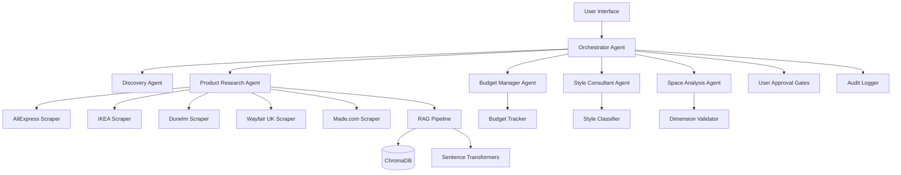

# Interior Design Multi-Agent System - Enhanced Architecture
**Project**: Jesmond House Interior Design System
**Budget**: £10,000
**Property**: 4-bedroom terraced house, Jesmond Dene Rd, Newcastle (1-year rental)
**Style**: Modern Eclectic

## Executive Summary

A multi-agent AI system that sources furniture from international (AliExpress) and UK retailers (IKEA, Dunelm, Wayfair, Made.com), using RAG for semantic product search, budget management, and professional interior design workflow.

## System Architecture



## Core Components

### 1. Orchestrator Agent
**Role**: Coordinates the 5-phase professional workflow

**Phases**:
1. **Discovery** - Gather requirements, style preferences, constraints
2. **Concept Development** - Create mood boards, define aesthetic direction
3. **Detailed Design** - Room-by-room specifications with products
4. **Budget Review** - Cost optimization and allocation approval
5. **Implementation Planning** - Purchasing timeline and delivery coordination

### 2. Discovery Agent
**Inputs**:
- Property details (4 bedrooms, terraced house)
- Budget constraint (£10k)
- Rental duration (1 year)
- Style preference (modern eclectic)
- Floor plans (optional, adaptable)
- Photos (optional, adaptable)

**Outputs**:
- [`ClientBrief`](../interior-design-system/models/schemas.py:30) Pydantic model
- Room priorities (e.g., living room: £3-3.5k, master bedroom: £2.5-3k)
- Functional requirements per room
- Must-have vs. nice-to-have items

### 3. Style Consultant Agent
**Capabilities**:
- Flexible style classification for "modern eclectic"
- Multi-aesthetic mixing (contemporary + unique/vintage pieces)
- Color palette generation
- Material recommendations
- Pattern and texture guidance

**Style Tags System**:
```python
# Flexible classification
modern_eclectic_tags = {
    "primary": ["modern", "contemporary"],
    "secondary": ["eclectic", "bohemian", "mid-century"],
    "accent": ["industrial", "vintage", "artistic"],
    "materials": ["mixed-metals", "natural-wood", "textured-fabrics"],
    "colors": ["neutral-base", "bold-accents", "warm-tones"]
}
```

### 4. Product Research Agent
**Multi-Source Search**:
- AliExpress: Unique, affordable statement pieces (4-8 week shipping acceptable)
- IKEA: Practical basics, good value
- Dunelm: Soft furnishings, textiles
- Wayfair UK: Mid-range furniture variety
- Made.com: Contemporary design pieces

**RAG Pipeline**:
```python
# Semantic search using sentence-transformers
query = "modern velvet sofa in jewel tones with metal legs"
embeddings = sentence_transformer.encode(query)
results = vector_db.search(embeddings, top_k=20)
filtered = filter_by_budget_style_dimensions(results)
ranked = rerank_by_relevance_and_value(filtered)
```

**Currency Handling**:
- CNY → GBP conversion with live exchange rates
- Import duty calculator (UK threshold: £135)
- Total landed cost calculation

### 5. Budget Manager Agent
**Allocation Strategy**:
```python
budget_allocation = {
    "living_room": {"min": 3000, "max": 3500},  # 30-35%
    "master_bedroom": {"min": 2500, "max": 3000},  # 25-30%
    "bedroom_2": {"min": 1200, "max": 1500},  # 12-15%
    "bedroom_3": {"min": 1200, "max": 1500},  # 12-15%
    "bedroom_4": {"min": 800, "max": 1000},  # 8-10%
    "shared_spaces": {"min": 300, "max": 500},  # 3-5%
    "contingency": {"min": 500, "max": 1000}  # 5-10%
}
```

**Tracking**:
- Real-time spend monitoring
- Alert when nearing room/total limits
- Value-per-room analysis
- Cost optimization suggestions

### 6. Space Analysis Agent
**Adaptable Input Handling**:
- **With floor plans**: Extract dimensions, room shapes, door/window placement
- **Without floor plans**: Use typical UK terraced house dimensions as baseline
- **Progressive enhancement**: Update recommendations when plans provided

**Typical UK Terraced House** (Jesmond):
```python
baseline_dimensions = {
    "living_room": {"width_cm": 400, "depth_cm": 500},
    "master_bedroom": {"width_cm": 350, "depth_cm": 400},
    "bedroom_2_3": {"width_cm": 300, "depth_cm": 350},
    "bedroom_4": {"width_cm": 250, "depth_cm": 300}
}
```

## Technical Stack

### Core Dependencies
```
# Already in requirements.txt (minimal)
anthropic>=0.39.0
pydantic>=2.10.5
pydantic-settings>=2.7.1
python-dotenv>=1.0.1
pytest>=8.3.4

# New dependencies to add
requests>=2.32.0              # HTTP requests for scrapers
beautifulsoup4>=4.12.0       # HTML parsing
lxml>=5.3.0                  # Fast XML/HTML parser
selenium>=4.27.0             # Dynamic content scraping
sentence-transformers>=3.3.1 # Embeddings for RAG
chromadb>=0.5.23            # Vector database
fastapi>=0.115.6            # API framework
uvicorn>=0.34.0             # ASGI server
httpx>=0.28.1               # Async HTTP client
rich>=13.9.4                # CLI formatting
```

### Web Scraping Architecture

**Base Scraper Pattern**:
```python
class BaseScraper:
    def __init__(self, rate_limit: float = 1.0):
        self.rate_limit = rate_limit
        self.session = self._create_session()
    
    async def search(self, query: str, filters: dict) -> List[Product]:
        """Search retailer and return normalized products"""
        pass
    
    def normalize_product(self, raw_data: dict) -> Product:
        """Convert retailer format to unified Product schema"""
        pass
```

**Retailer-Specific Implementations**:

1. **AliExpressScraper**
   - Use Selenium for dynamic content
   - Handle currency conversion (CNY → GBP)
   - Extract shipping costs and delivery times
   - Filter by seller rating (≥4.5 stars)

2. **IKEAScraper**
   - IKEA API (if available) or scrape product pages
   - Extract UK pricing and stock
   - Include assembly requirements
   - Sustainability info

3. **DunelmScraper**
   - HTML parsing with BeautifulSoup
   - Focus on soft furnishings categories
   - UK-only pricing and availability

4. **WayfairUKScraper**
   - Handle category navigation
   - Extract detailed specs
   - Multiple images per product

5. **MadeComScraper**
   - Parse design-focused listings
   - Extract lead times (custom orders)
   - Contemporary style filtering

### RAG Pipeline Implementation

```python
# 1. Product Embedding
from sentence_transformers import SentenceTransformer

model = SentenceTransformer('all-MiniLM-L6-v2')
product_text = f"{product.name} {product.description} {' '.join(product.style_tags)}"
embedding = model.encode(product_text)

# 2. Vector Storage
import chromadb

chroma_client = chromadb.PersistentClient(path="./data/chroma")
collection = chroma_client.create_collection(
    name="products",
    metadata={"hnsw:space": "cosine"}
)

# 3. Semantic Search
query_embedding = model.encode(user_query)
results = collection.query(
    query_embeddings=[query_embedding],
    n_results=50,
    where={"price_gbp": {"$lte": max_budget}}
)
```

### Agent Implementation Pattern

```python
from anthropic import Anthropic
from pydantic import BaseModel

class AgentResponse(BaseModel):
    recommendations: List[dict]
    reasoning: str
    next_steps: List[str]

class BaseAgent:
    def __init__(self, anthropic_client: Anthropic):
        self.client = anthropic_client
        self.system_prompt = self._load_system_prompt()
    
    async def execute(self, input_data: dict) -> AgentResponse:
        """Execute agent task with structured output"""
        response = await self.client.messages.create(
            model="claude-sonnet-4-20250514",
            max_tokens=4096,
            system=self.system_prompt,
            messages=[{"role": "user", "content": json.dumps(input_data)}]
        )
        return AgentResponse.model_validate_json(response.content[0].text)
```

## Data Models

### Unified Product Schema
```python
class Product(BaseModel):
    product_id: str
    name: str
    retailer: str  # "aliexpress" | "ikea" | "dunelm" | "wayfair" | "made"
    price_gbp: float
    price_original: Optional[float]  # CNY for AliExpress
    currency_original: Optional[str]
    url: str
    images: List[str]
    dimensions: Dimensions
    category: str
    style_tags: List[str]
    color_palette: List[str]
    material: List[str]
    in_stock: bool
    delivery_days: int
    shipping_cost_gbp: float
    import_duty_gbp: Optional[float]  # For AliExpress
    total_cost_gbp: float  # Price + shipping + duty
    seller_rating: Optional[float]  # For AliExpress
    sustainability_score: Optional[int]  # 1-5
```

## User Interface Options

### Option 1: CLI (MVP)
```bash
$ python main.py init
$ python main.py discover --budget 10000 --style "modern eclectic"
$ python main.py search --room "living_room" --item "sofa"
$ python main.py review --phase "concept"
$ python main.py approve --phase "concept"
```

### Option 2: FastAPI + Web UI
```python
# Endpoints
POST /api/sessions
POST /api/discover
GET  /api/products/search
POST /api/products/select
GET  /api/budget/status
POST /api/approve/{phase}
GET  /api/recommendations/{room}
```

### Option 3: Hybrid (Recommended)
- CLI for quick interactions
- Web UI for visual review (images, mood boards)
- JSON export for persistence

## Workflow Example

```python
# Phase 1: Discovery
discovery = DiscoveryAgent()
client_brief = await discovery.gather_requirements(
    property="4-bed terraced, Jesmond",
    budget=10000,
    style="modern eclectic",
    rental_period="1 year"
)

# Phase 2: Concept Development
style = StyleConsultantAgent()
concept = await style.create_concept(client_brief)
# User reviews mood board, approves direction

# Phase 3: Product Research
products = ProductResearchAgent()
living_room_items = await products.search_room(
    room="living_room",
    budget=3500,
    style_tags=concept.style_tags,
    required_items=["sofa", "coffee_table", "rug", "lighting"]
)

# Phase 4: Budget Review
budget = BudgetManagerAgent()
allocation = budget.analyze_spend(living_room_items)
# Suggest optimizations if over budget

# Phase 5: Implementation Plan
orchestrator = OrchestratorAgent()
plan = orchestrator.create_purchase_plan(
    all_selected_items,
    prioritize_by="delivery_time"
)
```

## Quality Assurance

### Validation Layers
1. **Dimension Validator**: Ensure furniture fits in UK terraced house rooms
2. **Style Consistency Checker**: Verify items work together aesthetically
3. **Budget Enforcer**: Hard stop if allocation exceeded
4. **Delivery Timeline**: Flag long-wait items early in 1-year rental

### Testing Strategy
```python
# Mocked scrapers for fast testing
class MockAliExpressScraper(BaseScraper):
    def search(self, query: str) -> List[Product]:
        return load_test_fixtures("aliexpress_sofas.json")

# Integration tests
def test_living_room_complete_workflow():
    orchestrator = Orchestrator(use_mocks=True)
    result = orchestrator.design_room("living_room", budget=3500)
    
    assert result.total_cost <= 3500
    assert len(result.items) >= 4  # sofa, coffee table, rug, lighting
    assert all(item.dimensions.fits_in_room() for item in result.items)
```

## Deployment

### Local Development
```bash
# 1. Set up environment
python -m venv venv
source venv/bin/activate
pip install -r requirements.txt

# 2. Configure
cp .env.example .env
# Add ANTHROPIC_API_KEY

# 3. Initialize database
python -m scripts.init_chromadb

# 4. Run scraper setup
python -m scripts.test_scrapers

# 5. Start system
python main.py
```

### Production Considerations
- Rate limiting for web scrapers (respect robots.txt)
- Caching product data (24-hour TTL)
- Async scraping for performance
- Error handling and retries
- Audit logging for all decisions

## Success Metrics

1. **Completeness**: All 4 bedrooms + living areas designed within budget
2. **Accuracy**: Product recommendations match modern eclectic aesthetic
3. **Value**: Average cost-per-item < comparable retail
4. **Feasibility**: All items fit dimensions, available for purchase
5. **Speed**: Complete design in < 2 hours of user interaction time

## Next Steps

1. Research scraper feasibility for each retailer
2. Implement base scraping infrastructure
3. Build RAG pipeline with sample products
4. Create Discovery Agent with Claude
5. Develop budget allocation logic
6. Build CLI interface
7. Test end-to-end workflow
8. Add web UI for visual review
9. Deploy and iterate based on user feedback

---

**Note**: This architecture is designed to be modular and extensible. Additional retailers, style preferences, or room types can be added without major refactoring.