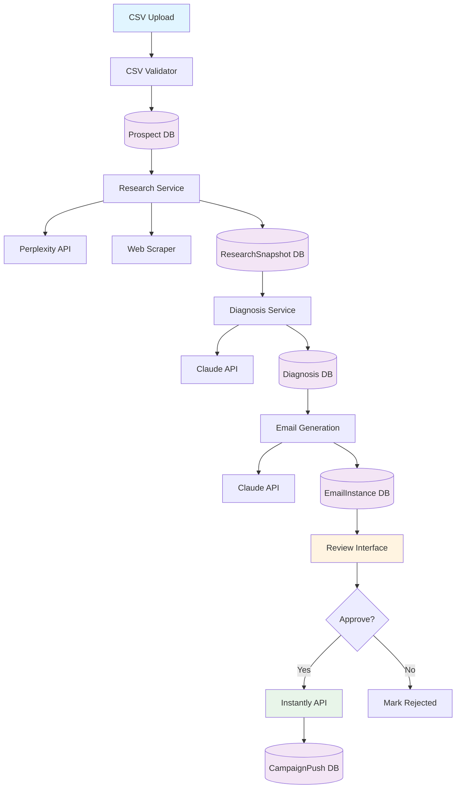
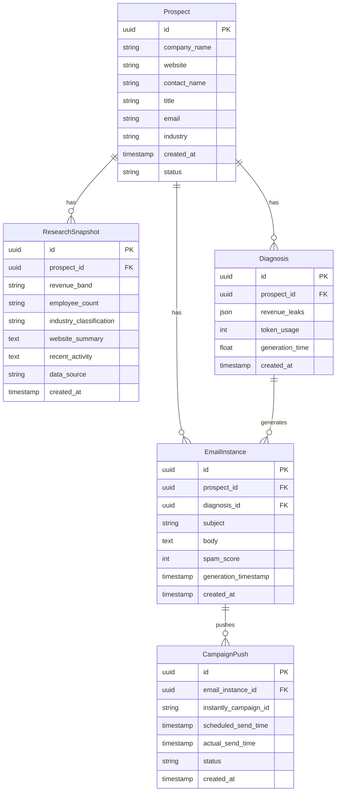
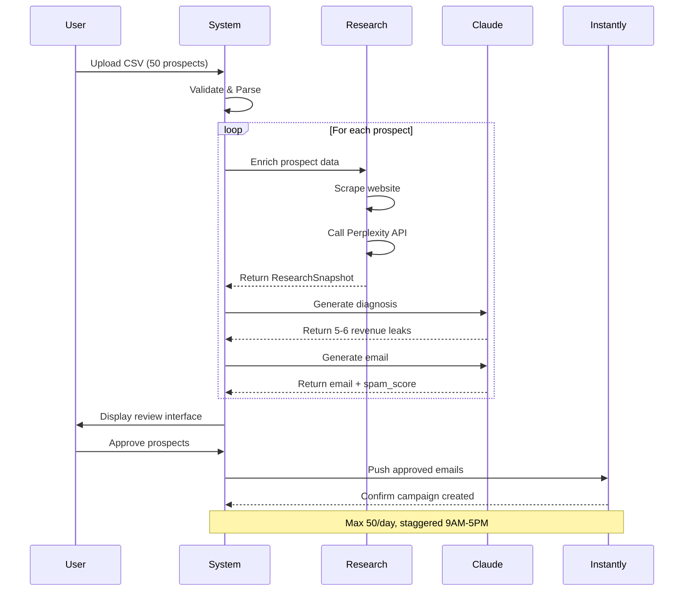
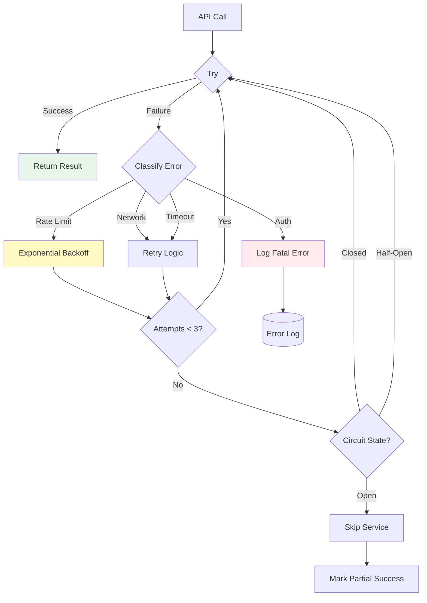

# Lead Engine Architecture Plan

**Project:** Internal Lead Engine System (v1)  
**Date:** January 12, 2026  
**Status:** Planning Phase  

## System Overview

This is an internal, single-tenant system for processing prospect leads through AI-powered research, diagnosis, email generation, and Instantly integration. The system must process 50 prospects completely in ≤10 minutes (excluding manual review).

## Architecture Diagram



## Data Model Relationships



## Processing Pipeline



## Technology Stack Recommendations

### Backend
- **Language:** Python 3.11+
- **Framework:** FastAPI (async support, automatic API docs)
- **Database:** PostgreSQL 15+ (JSONB support for revenue_leaks)
- **ORM:** SQLAlchemy 2.0+ with async support
- **Task Queue:** Redis + Celery (for background processing)

### External APIs
- **AI:** Anthropic Claude API (diagnosis + email generation)
- **Research:** Perplexity API or similar
- **Email:** Instantly API
- **Web Scraping:** BeautifulSoup4 + Playwright (JavaScript rendering)

### Frontend (Review Interface)
- **Framework:** Simple HTML/CSS/JS or React (lightweight)
- **Styling:** Tailwind CSS (rapid development)
- **State Management:** None needed (simple forms)

### Testing
- **Unit Tests:** pytest + pytest-asyncio
- **Integration Tests:** pytest with fixtures
- **API Mocking:** responses library or VCR.py
- **Coverage:** pytest-cov (target >80%)

### Infrastructure
- **Environment:** Docker containers
- **Config:** python-dotenv + Pydantic Settings
- **Logging:** structlog (JSON logs)
- **Monitoring:** Prometheus metrics + Grafana dashboards

## Key Technical Decisions

### 1. Database Choice: PostgreSQL
**Rationale:** JSONB support for flexible revenue_leaks storage, excellent indexing, ACID compliance for data integrity.

### 2. Async Processing
**Rationale:** Parallel API calls for 50 prospects to meet 10-minute target:
- 50 prospects × 3 API calls = 150 API calls
- With async: ~2-3 minutes (vs 10+ minutes sequential)
- Celery workers handle background tasks

### 3. Circuit Breaker Pattern
**Rationale:** Prevent cascade failures when external APIs are down:
- Track failure rate per API
- Open circuit after 5 consecutive failures
- Half-open state after 30s timeout
- Protects system stability

### 4. Retry Strategy
**Rationale:** Handle transient failures gracefully:
- Exponential backoff: 1s, 2s, 4s
- Max 3 attempts per API call
- Specific exceptions for rate limits vs network errors
- Preserve partial progress

### 5. Schema Validation
**Rationale:** Ensure data quality at every stage:
- Pydantic models for all data structures
- Validate Claude JSON responses match expected schema
- Validate CSV format before processing
- Prevent malformed data propagation

## Performance Optimization Strategy

### Target: 50 Prospects in ≤10 Minutes

**Breakdown:**
1. CSV Upload + Validation: 10 seconds
2. Research (50 prospects): 150 seconds (3 min, parallel)
3. Diagnosis (50 prospects): 200 seconds (3.3 min, parallel)
4. Email Generation (50 prospects): 150 seconds (2.5 min, parallel)
5. Total: ~510 seconds = 8.5 minutes ✓

**Optimization Techniques:**
- **Parallel Processing:** asyncio for I/O-bound tasks
- **Connection Pooling:** Reuse HTTP connections
- **Batch API Calls:** Where supported by APIs
- **Caching:** Cache repeated website scrapes (24h TTL)
- **Database Indexes:** On foreign keys and status fields

### Manual Review: ≤15 Minutes for 50 Prospects

**UI Optimization:**
- Pagination: 20 prospects per page (3 pages)
- Keyboard shortcuts: Space=approve, Backspace=reject, Arrow keys=navigate
- Bulk actions: Select all visible, approve selected
- Auto-save on approve/reject (no submit button)
- Target: 18 seconds per prospect review

## Error Handling Architecture



## Security Considerations

### API Keys
- Store in environment variables, never in code
- Use separate keys for dev/staging/prod
- Rotate keys quarterly
- Monitor API usage for anomalies

### Data Protection
- No PII in logs (mask email, names)
- Database encryption at rest
- HTTPS for all API communications
- Rate limiting on CSV upload endpoint

### Input Validation
- CSV: Max 100 rows, validate email format
- Sanitize website URLs (prevent SSRF)
- Validate all user inputs (XSS prevention)
- SQL injection protection via ORM

## Monitoring & Metrics

### Key Metrics to Track

**Performance Metrics:**
- Average processing time per stage
- P50, P95, P99 latency for API calls
- Success rate by stage (research, diagnosis, email)
- Total batch processing time

**Business Metrics:**
- Total prospects processed (daily, weekly)
- Approval rate (approved/total)
- Email spam scores distribution
- Instantly send success rate

**API Costs:**
- Claude tokens consumed (input + output)
- Perplexity API calls count
- Cost per prospect
- Monthly API spend

**Error Metrics:**
- Failures by stage and reason
- Circuit breaker open events
- Retry attempts histogram
- Fatal error rate

### Alert Thresholds
- Processing time >15 minutes: WARNING
- Success rate <90%: CRITICAL
- API cost >$100/day: WARNING
- Error rate >5%: WARNING

## Testing Strategy

### Unit Tests (Target: 80% coverage)
- Data models: Field validation, relationships
- Services: Business logic, error handling
- Utils: Parsing, formatting functions
- Mocked external dependencies

### Integration Tests
- CSV upload with various formats
- API clients with recorded responses (VCR.py)
- Database operations (test DB)
- End-to-end pipeline with 3 test prospects

### Performance Tests
- 50-prospect batch under load
- Concurrent CSV uploads
- API timeout handling
- Memory leak detection

### Test Data
- 3 diverse prospect scenarios:
  1. Large enterprise (10k+ employees)
  2. Small business (10-50 employees)
  3. Edge case (minimal web presence)

## Validation Checklist (VALIDATION_LOG.md)

Each step completion requires documentation:
1. **What was implemented:** Component/feature details
2. **Test cases executed:** Specific inputs and scenarios
3. **Expected vs actual results:** Pass/fail criteria
4. **Edge cases discovered:** Unexpected behaviors
5. **Technical decisions:** When spec ambiguous
6. **Performance metrics:** Timing, API costs

## Project Structure

```
lead-engine/
├── README.md
├── requirements.txt
├── .env.example
├── Dockerfile
├── docker-compose.yml
├── VALIDATION_LOG.md
├── ENGINE_README.md
├── models/
│   ├── __init__.py
│   ├── prospect.py
│   ├── research_snapshot.py
│   ├── diagnosis.py
│   ├── email_instance.py
│   └── campaign_push.py
├── services/
│   ├── __init__.py
│   ├── csv_handler.py
│   ├── research_service.py
│   ├── diagnosis_service.py
│   ├── email_service.py
│   └── instantly_service.py
├── api/
│   ├── __init__.py
│   ├── main.py
│   ├── routes.py
│   └── dependencies.py
├── clients/
│   ├── __init__.py
│   ├── claude_client.py
│   ├── perplexity_client.py
│   └── instantly_client.py
├── utils/
│   ├── __init__.py
│   ├── retry.py
│   ├── circuit_breaker.py
│   ├── logger.py
│   └── metrics.py
├── web/
│   ├── static/
│   │   ├── css/
│   │   └── js/
│   └── templates/
│       └── review.html
├── tests/
│   ├── unit/
│   ├── integration/
│   ├── e2e/
│   └── fixtures/
└── docs/
    ├── api_specs.md
    └── deployment.md
```

## Implementation Phases

### Phase A: Core Engine (Steps 1-49)
**Goal:** CSV → Research → Diagnosis → Email  
**Validation:** 50 prospects processed in <10 minutes

### Phase B: Instantly Integration (Steps 50-74)
**Goal:** Review UI + Instantly push  
**Validation:** End-to-end flow with 3 test prospects

### Phase C: Hardening (Steps 75-111)
**Goal:** Production-ready reliability  
**Validation:** All error scenarios handled, metrics tracked

## Next Steps

1. ✅ Architectural plan approved
2. ⏭️ Switch to Code/Orchestrator mode for implementation
3. ⏭️ Begin Phase A: Step 1 - Project structure setup
4. ⏭️ Follow sequential validation after each step
5. ⏭️ Document all decisions in VALIDATION_LOG.md

---

**Ready for Implementation:** This plan provides complete context for executing the 112-step todo list with technical clarity for a non-coder founder to understand and validate progress.