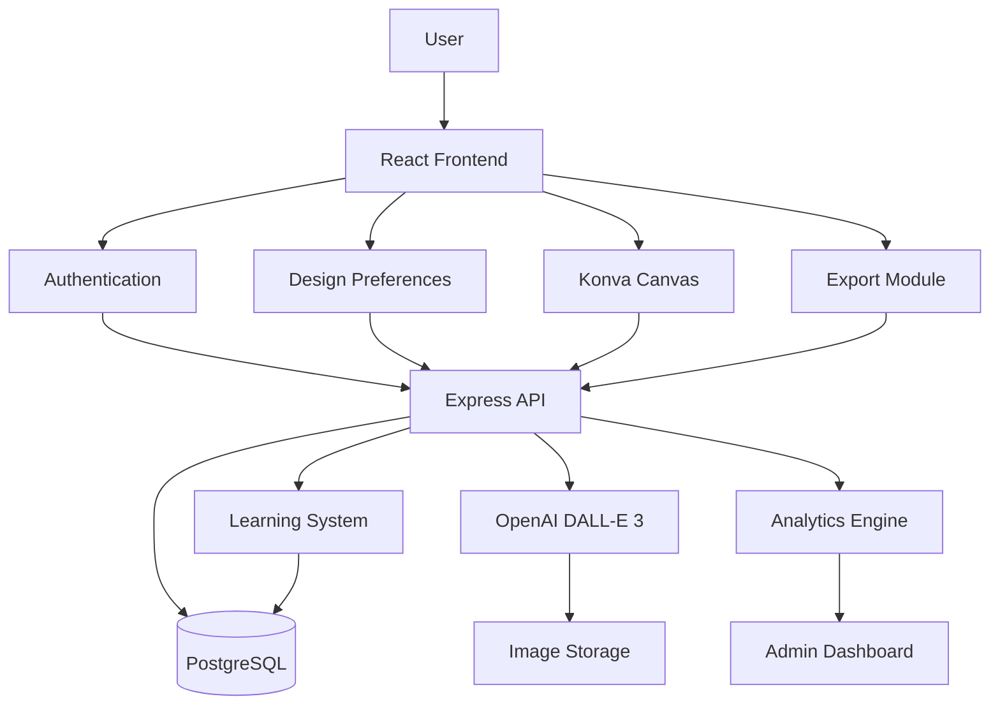
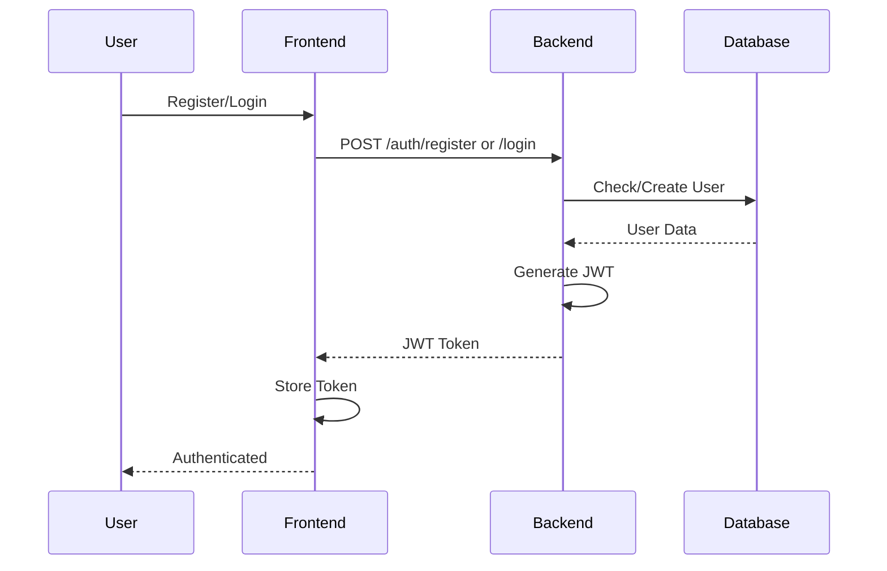
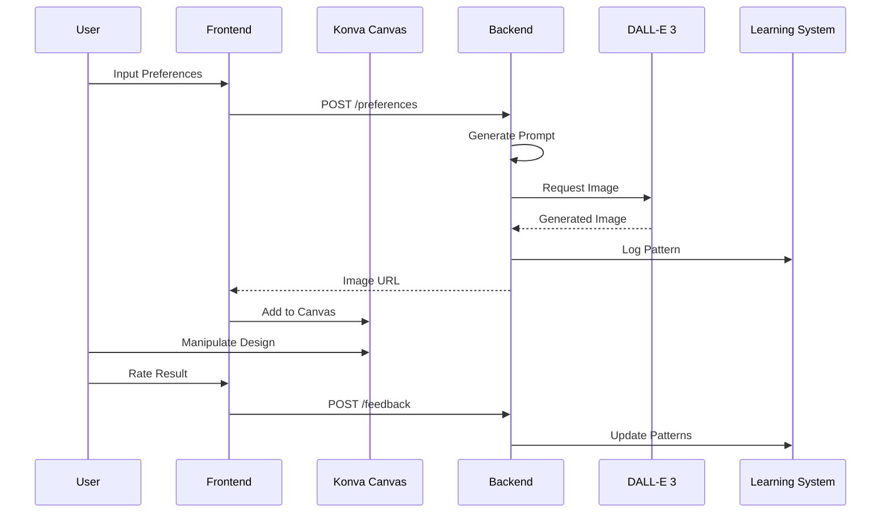
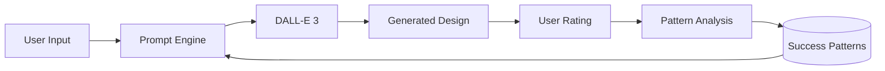
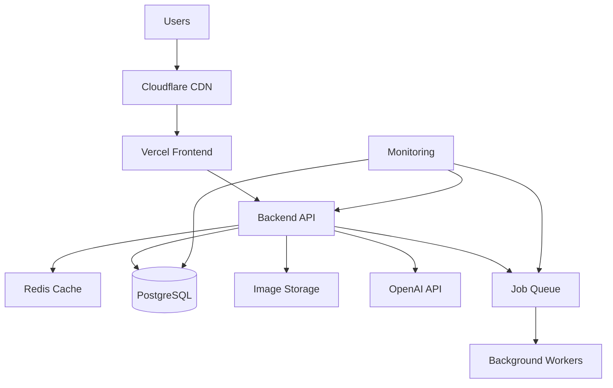

# Melanin Design Platform - System Architecture

## Technical Stack (Final)

### Frontend
- **Framework**: React 18 + TypeScript + Vite
- **Styling**: Tailwind CSS (custom melanin palette)
- **Canvas**: **Konva.js** (React-friendly, high performance)
- **State**: Zustand (global state)
- **Data Fetching**: React Query
- **Routing**: React Router v6

### Backend
- **Runtime**: Node.js + Express + TypeScript
- **Database**: PostgreSQL + Prisma ORM
- **Auth**: JWT tokens + bcryptjs
- **Validation**: Zod schemas
- **AI**: OpenAI DALL-E 3 API

## System Flow



## Core Components

### 1. Authentication Flow


### 2. Design Creation Flow


### 3. Learning System


## Database Schema

### Key Tables
- **Users**: Authentication and profile
- **DesignPreferences**: Style, colors, themes, cultural elements
- **DesignSessions**: Canvas state, active designs
- **GeneratedPrompts**: Prompts sent to AI with ratings
- **DesignOutputs**: Final images and exports
- **PromptPatterns**: Learning data (what works)
- **AnalyticsEvents**: Tracking and metrics

## API Endpoints

### Authentication
- `POST /api/auth/register` - User registration
- `POST /api/auth/login` - User login
- `GET /api/auth/me` - Get current user (protected)

### Design Preferences
- `GET /api/preferences` - Get user preferences
- `POST /api/preferences` - Save preferences
- `PUT /api/preferences/:id` - Update preferences

### Design Sessions
- `POST /api/sessions` - Create new session
- `GET /api/sessions/:id` - Get session state
- `PUT /api/sessions/:id` - Update canvas state
- `POST /api/sessions/:id/generate` - Generate AI image

### AI Integration
- `POST /api/ai/generate` - Generate image from prompt
- `POST /api/ai/feedback` - Submit rating/feedback

### Export
- `POST /api/export` - Export design
- `GET /api/export/:id` - Download exported file

### Analytics (Admin)
- `GET /api/analytics/dashboard` - Dashboard metrics
- `GET /api/analytics/patterns` - Success patterns
- `GET /api/analytics/prompts` - Prompt performance

## Konva.js Canvas Structure

### Layer Organization
```
Stage (main container)
├── Background Layer
│   └── Background elements
├── Design Layer
│   ├── AI-generated images
│   ├── Text elements
│   └── Shapes/patterns
├── UI Layer
│   ├── Guidelines
│   ├── Bounding boxes
│   └── Controls
└── Export Layer (hidden)
    └── Final composite
```

### Key Features
- Drag and drop elements
- Resize and rotate
- Layer reordering
- Undo/redo stack
- Export to PNG/SVG/PDF
- Zoom and pan
- Real-time preview

## Prompt Generation Engine

### Input Processing
```javascript
{
  style: ["modern", "geometric"],
  colors: ["#8B4513", "#D2691E", "#F4A460"],
  themes: ["celebration", "daily-life"],
  culturalElements: ["kente-patterns", "natural-hair"],
  productType: "poster"
}
```

### Prompt Template
```
Create a {productType} design featuring {themes} in {style} style.
Use a color palette of {colors}.
Incorporate {culturalElements} that celebrate melanin beauty.
The design should be suitable for {marketplace} with {dimensions}.
Focus on: {additionalContext}
```

### Learning Enhancement
- Track which prompt structures get highest ratings
- Identify successful color combinations
- Learn effective cultural element pairings
- Optimize for specific product types

## Export Formats

### Etsy Products
- **Posters**: 18x24", 24x36", 300 DPI
- **T-shirts**: 12x12" transparent PNG, 300 DPI
- **Mugs**: 11oz wrap (2475x1155px), 15oz wrap (2850x1155px)
- **Wrapping Paper**: Seamless repeat pattern

### Print-on-Demand
- **Redbubble**: Various sizes, RGB color profile
- **Printful**: Specific size requirements per product
- **Society6**: Art prints and home decor specs

## Security Considerations

### Authentication
- Passwords hashed with bcryptjs (10 rounds)
- JWT tokens with 24h expiration
- Refresh token rotation
- httpOnly cookies for token storage

### API Protection
- Rate limiting on all endpoints
- Input validation with Zod schemas
- SQL injection prevention via Prisma
- CORS configuration for frontend origin only

### Image Storage
- Secure S3/R2 bucket with signed URLs
- Image optimization before storage
- CDN caching for performance
- Automatic cleanup of old images

## Performance Optimization

### Frontend
- Code splitting by route
- Lazy loading for canvas components
- React Query caching for API calls
- Debounced canvas state saves
- Image optimization before upload

### Backend
- Database connection pooling
- Query optimization with Prisma
- Caching frequent queries (Redis optional)
- Background jobs for AI generation
- Pagination for list endpoints

### AI Integration
- Queue system for image generation
- Timeout handling (30s max)
- Retry logic with exponential backoff
- Cost tracking per generation
- Batch processing when possible

## Deployment Architecture



### Production Stack
- **Frontend**: Vercel (automatic deployments from Git)
- **Backend**: Railway or Render (Docker container)
- **Database**: Supabase or Railway PostgreSQL
- **Storage**: AWS S3 or Cloudflare R2
- **CDN**: Cloudflare
- **Monitoring**: Sentry for errors, LogRocket for sessions

## Development Phases

### Phase 1: Foundation ✅
- Project structure
- TypeScript configuration
- Database schema
- Basic routing

### Phase 2: Authentication (Next)
- User registration/login
- JWT implementation
- Protected routes
- Auth middleware

### Phase 3: Design Input
- Preference forms
- API endpoints
- Data validation
- State management

### Phase 4: AI Integration
- DALL-E 3 connection
- Prompt generation
- Image handling
- Error handling

### Phase 5: Konva Canvas
- Canvas setup
- Element manipulation
- Layer management
- Export functionality

### Phase 6: Learning System
- Rating interface
- Pattern tracking
- Analytics engine
- Admin dashboard

### Phase 7: Deployment
- Production setup
- Environment configuration
- Testing
- Launch

## Success Metrics

### Technical
- API response time < 200ms
- Canvas interactions < 16ms (60 FPS)
- AI generation time < 10s
- 99.9% uptime

### Business
- User satisfaction ratings
- Prompt success rate
- Export conversion rate
- Learning improvement over time