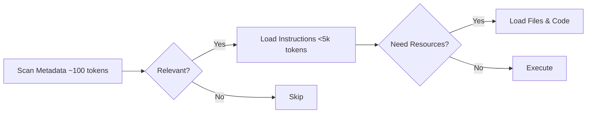
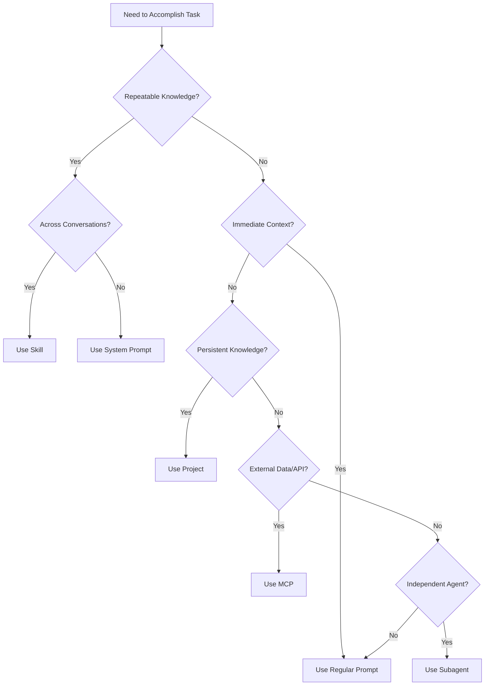

# Claude Skills Reference Guide

**Last Updated:** December 27, 2024  
**Purpose:** Complete reference for Claude Skills - what they are, how to use them, and how they fit into your Kilo Code workflow

---

## Executive Summary

**Claude Skills** are specialized folders containing instructions, scripts, and resources that Claude dynamically discovers and loads when relevant to tasks. They teach Claude how to perform tasks in a repeatable, efficient way across all platforms (Claude.ai, Claude Code, and Claude API).

**Key Benefits:**
- **Reusable expertise** - Write once, use everywhere
- **Token efficient** - Only loads when needed (progressive disclosure)
- **Version controlled** - Share, update, and manage centrally
- **Composable** - Multiple skills work together automatically

**When to Use Skills:**
- You find yourself typing the same prompt repeatedly
- You need consistent behavior across multiple conversations
- Complex workflows need to be standardized
- Specialized knowledge should be portable

---

## Table of Contents

1. [How Skills Work](#how-skills-work)
2. [Getting Started](#getting-started)
3. [Official Skills Catalog](#official-skills-catalog)
4. [Community Skills](#community-skills)
5. [Skills vs Other Approaches](#skills-vs-other-approaches)
6. [Security & Best Practices](#security-and-best-practices)
7. [Creating Custom Skills](#creating-custom-skills)
8. [Official Resources](#official-resources)
9. [Quick Reference](#quick-reference)

---

## How Skills Work

### Progressive Disclosure Architecture

Skills use a three-stage loading process for efficiency:



**Stage 1: Metadata Scanning (~100 tokens)**
- Claude scans available Skills
- Identifies relevant matches for current task
- Minimal context window impact

**Stage 2: Full Instructions (<5k tokens)**
- Loads when Claude determines Skill applies
- Contains detailed procedural knowledge
- Includes examples and guidelines

**Stage 3: Bundled Resources**
- Files and executable code load only as needed
- Scripts, templates, and reference materials
- On-demand, not all at once

This design allows multiple Skills to remain available without overwhelming Claude's context window.

---

## Getting Started

### Claude.ai Web Interface

1. Go to **Settings > Capabilities**
2. Enable **Skills** toggle
3. Browse available skills or upload custom skills
4. For Team/Enterprise: Admin must enable Skills organization-wide first

### Claude Code CLI

```bash
# Install skills from marketplace
/plugin marketplace add anthropics/skills

# Or install from local directory
/plugin add /path/to/skill-directory
```

### Claude API

Skills are accessible via the `/v1/skills` API endpoint.

```python
import anthropic

client = anthropic.Client(api_key="your-api-key")
# See API docs for full implementation details
```

**API Documentation:** [Claude Skills API](https://docs.anthropic.com/en/docs/skills-api)

---

## Official Skills Catalog

### Document Skills

Complex file format manipulation:

| Skill | Purpose | Key Features |
|-------|---------|--------------|
| **docx** | Word documents | Tracked changes, comments, formatting preservation, text extraction |
| **pdf** | PDF manipulation | Extract text/tables, create PDFs, merge/split, handle forms |
| **pptx** | PowerPoint | Layouts, templates, charts, automated slide generation |
| **xlsx** | Excel spreadsheets | Formulas, formatting, data analysis, visualization |

### Design & Creative

| Skill | Purpose | Key Features |
|-------|---------|--------------|
| **algorithmic-art** | Generative art | p5.js, seeded randomness, flow fields, particle systems |
| **canvas-design** | Visual art | PNG/PDF formats, design philosophies |
| **slack-gif-creator** | Animated GIFs | Optimized for Slack's size constraints |

### Development

| Skill | Purpose | Key Features |
|-------|---------|--------------|
| **frontend-design** | UI/UX design | Avoids "AI slop", bold decisions, React & Tailwind focused |
| **artifacts-builder** | Complex artifacts | React, Tailwind CSS, shadcn/ui components |
| **mcp-builder** | MCP server creation | High-quality MCP servers, external API integration |
| **webapp-testing** | Web app testing | Playwright for UI verification and debugging |

### Communication

| Skill | Purpose | Key Features |
|-------|---------|--------------|
| **brand-guidelines** | Anthropic branding | Official brand colors and typography for artifacts |
| **internal-comms** | Internal communications | Status reports, newsletters, FAQs |

### Skill Creation

| Skill | Purpose | Key Features |
|-------|---------|--------------|
| **skill-creator** | Interactive skill builder | Q&A guided creation process |

---

## Community Skills

> ⚠️ **Security Warning:** Skills can execute arbitrary code in Claude's environment. Only install skills from trusted sources. See [Security & Best Practices](#security-and-best-practices).

### Major Collections

**obra/superpowers** - Core skills library for Claude Code
- 20+ battle-tested skills including TDD, debugging, collaboration patterns
- Features `/brainstorm`, `/write-plan`, `/execute-plan` commands
- Includes `skills-search` tool
- **Installation:** `/plugin marketplace add obra/superpowers-marketplace`
- **Resources:**
  - [Main Repository](https://github.com/obra/superpowers)
  - [Community Skills](https://github.com/obra/superpowers-skills)
  - [Blog: Superpowers](https://blog.obra.net/superpowers)

**obra/superpowers-lab** - Experimental skills
- New techniques still being refined
- Uses cutting-edge approaches
- Install from superpowers-marketplace plugin
- [Development Blog](https://blog.obra.net)

### Individual Community Skills

| Skill | Description | Use Case |
|-------|-------------|----------|
| **ios-simulator-skill** | iOS app building & testing | App navigation, automation |
| **ffuf-web-fuzzing** | Web fuzzing guidance | Penetration testing, authenticated fuzzing, auto-calibration |
| **playwright-skill** | Browser automation | General-purpose web testing |
| **claude-d3js-skill** | Data visualization | d3.js visualizations |
| **claude-scientific-skills** | Scientific computing | Specialized libraries and databases |
| **web-asset-generator** | Web assets | Favicons, app icons, social media images |

### Community Tools

**Skill Seekers** - Convert documentation to Skills
- Tool: [yusufkaraaslan/Skill_Seekers](https://github.com/yusufkaraaslan/Skill_Seekers)
- Converts documentation websites into Claude Skills

---

## Skills vs Other Approaches

### Decision Matrix: When to Use What



### Comparison Table

| Feature | Skills | Prompts | Projects | Subagents | MCP |
|---------|--------|---------|----------|-----------|-----|
| **Purpose** | Reusable procedural knowledge | One-time instructions | Persistent background knowledge | Independent task execution | External data/API integration |
| **Portability** | Same everywhere | Copy-paste | Workspace-specific | Configured | Server-based |
| **Loading** | On-demand (30-50 tokens) | Always in context | Persistent | As needed | Varies |
| **Reusability** | High - version controlled | Low - manual | Medium | Medium | High |
| **Composability** | Automatic stacking | Manual | Manual | Can use Skills | Can integrate |
| **Code Execution** | Yes - bundled scripts | No | No | Yes | Provides tools |
| **Best For** | Repeatable tasks, workflows | Immediate context | Project context | Self-contained agents | Database/API access |

### Skills vs System Prompts

| Aspect | Skills | System Prompts |
|--------|--------|---------------|
| Structure | Folder with YAML frontmatter, instructions, scripts | Plain text instructions |
| Reusability | Version-controlled, shareable, composable | Copy-paste, conversation-specific |
| Loading | On-demand (only when relevant) | Always in context |
| Maintenance | Centralized updates | Manual updates per conversation |
| Token Efficiency | High - progressive disclosure | Low - always loaded |

**Rule:** If you find yourself typing the same prompt repeatedly across multiple conversations, create a Skill.

### Skills vs MCP (Model Context Protocol)

| Feature | Skills | MCP |
|---------|--------|-----|
| Purpose | Task-specific expertise and workflows | External data/API integration |
| Portability | Same format everywhere | Requires server configuration |
| Code Execution | Can include executable scripts | Provides tools/resources |
| Token Efficiency | 30-50 tokens until loaded | Varies by implementation |
| Best For | Repeatable tasks, document workflows | Database access, API integrations |

**Combined Approach:** Skills can create MCP servers! The `mcp-builder` skill helps build high-quality MCP integrations.

### Skills vs Subagents

**Use Skills when:**
- Capabilities should be accessible to any Claude instance
- You need portable expertise
- Procedural knowledge is the focus

**Use Subagents when:**
- Need self-contained agents for specific purposes
- Independent workflows required
- Restricted tool access needed

**Combined Approach:** Subagents can leverage Skills for specialized expertise, merging independence with portable knowledge.

---

## Security and Best Practices

### ⚠️ Security Warning

**CRITICAL:** Skills can execute arbitrary code in Claude's environment. Only install skills from trusted sources.

### Security Guidelines

1. **Source Verification**
   - Only install from official Anthropic repository
   - Verify community skills from trusted developers
   - Check GitHub stars/activity for community skills
   - Review skill code before installation

2. **Code Review**
   - Read all scripts before running
   - Understand what permissions are requested
   - Check for network requests
   - Verify file system access patterns

3. **Permission Management**
   - Grant minimum necessary permissions
   - Monitor skill behavior
   - Revoke access if suspicious activity
   - Regular audit of installed skills

### Best Practices

**When Creating Skills:**
- Follow progressive disclosure principles
- Keep instructions clear and concise
- Include error handling
- Document edge cases
- Test thoroughly before sharing

**When Using Skills:**
- Start with official skills
- Test community skills in safe environment
- Keep skills updated
- Remove unused skills
- Monitor token usage

**Token Efficiency:**
- Skills load on-demand (~30-50 tokens)
- Multiple skills can coexist
- Progressive disclosure prevents context window bloat
- Only relevant skills activate

**Maintenance:**
- Version control your custom skills
- Document changes
- Test after updates
- Share with team when ready

---

## Creating Custom Skills

### Skill Structure

```
my-skill/
├── skill.yaml          # Metadata and configuration
├── instructions.md     # Main instructions for Claude
├── examples/          # Optional: example files
├── scripts/           # Optional: executable code
└── resources/         # Optional: reference materials
```

### Basic skill.yaml

```yaml
name: "My Custom Skill"
version: "1.0.0"
description: "Brief description of what this skill does"
author: "Your Name"
tags:
  - category1
  - category2
triggers:
  - "keyword1"
  - "keyword2"
```

### Instructions Format

```markdown
# Skill Name

## Purpose
Clear statement of what this skill accomplishes.

## When to Use
- Specific scenario 1
- Specific scenario 2
- Specific scenario 3

## Instructions

### Step 1: [Action]
Detailed instructions...

### Step 2: [Action]
Detailed instructions...

## Examples

### Example 1
[Show specific example]

## Edge Cases
- Handle case A by doing X
- Handle case B by doing Y
```

### Development Workflow

1. **Plan**
   - Define clear scope
   - Identify triggers
   - List required resources

2. **Create**
   - Write skill.yaml
   - Draft instructions.md
   - Add examples
   - Include scripts if needed

3. **Test**
   - Test in isolated environment
   - Verify trigger keywords
   - Check resource loading
   - Test edge cases

4. **Refine**
   - Optimize instructions
   - Improve token efficiency
   - Add error handling
   - Document learnings

5. **Share**
   - Version control
   - Document usage
   - Provide examples
   - Maintain updates

### Using skill-creator Skill

The official `skill-creator` skill provides interactive guidance:

```
# In Claude
"I want to create a new skill for [purpose]"

# skill-creator will:
1. Ask clarifying questions
2. Generate skill structure
3. Create initial templates
4. Provide testing guidance
```

---

## Official Resources

### Documentation

- [Claude Skills Announcement](https://www.anthropic.com/news/claude-skills) - Official announcement
- [What are Skills?](https://support.anthropic.com/en/articles/9523428-what-are-skills) - Support article
- [Using Skills in Claude](https://support.anthropic.com/en/articles/9523429-using-skills-in-claude) - Usage guide
- [Skills Explained](https://www.anthropic.com/news/skills-explained) - Comprehensive guide covering architecture, decision matrices, best practices
- [Equipping Agents with Skills](https://www.anthropic.com/news/equipping-agents-with-skills) - Engineering deep dive
- [Claude Developer Platform](https://docs.anthropic.com/) - Official documentation
- [Skills API Endpoint](https://docs.anthropic.com/en/docs/skills-api) - API documentation

### Repositories & Examples

- [anthropics/skills](https://github.com/anthropics/skills) - Official public repository
- [Claude Cookbooks - Skills](https://github.com/anthropics/anthropic-cookbook/tree/main/skills) - Example notebooks and tutorials

### Tutorials & Guides

**Written:**
- [How to Create Your First Claude Skill](https://dev.to/skills-tutorial) - Step-by-step tutorial
- [How to Use Skills in Claude Code](https://medium.com/@skills-guide) - Installation and testing guide

**Video:**
- Coming soon

### Community Articles

- [Skills Explained - Anthropic Blog](https://www.anthropic.com/news/skills-explained) - Progressive disclosure, use cases, decision framework
- [Claude Skills are awesome, maybe a bigger deal than MCP - Simon Willison](https://simonwillison.net/claude-skills) - Technical deep dive

---

## Quick Reference

### Common Use Cases

| Task | Recommended Approach |
|------|---------------------|
| Edit Word documents | Use `docx` skill |
| Create PDFs | Use `pdf` skill |
| Design UI components | Use `frontend-design` skill |
| Build MCP server | Use `mcp-builder` skill |
| Test web app | Use `webapp-testing` skill |
| Generate art | Use `algorithmic-art` skill |
| Create slide deck | Use `pptx` skill |
| Analyze spreadsheet | Use `xlsx` skill |

### Decision Checklist

**Create a Skill when:**
- ✅ You repeat the same instructions across conversations
- ✅ Task requires consistent approach
- ✅ Knowledge should be portable
- ✅ Multiple people need same capability
- ✅ Procedure has clear steps

**Use System Prompt when:**
- ✅ Instructions are conversation-specific
- ✅ One-time customization needed
- ✅ Context is unique to this chat
- ✅ Behavior needs temporary override

**Use MCP when:**
- ✅ Need to access external data
- ✅ Integrating with APIs
- ✅ Connecting to databases
- ✅ Real-time data required

**Use Project when:**
- ✅ Knowledge is workspace-specific
- ✅ Context persists across conversations
- ✅ Team shares common background
- ✅ Project-specific conventions apply

### Troubleshooting

**Skill not loading:**
- Check trigger keywords
- Verify skill.yaml format
- Ensure skill is enabled
- Review skill permissions

**Performance issues:**
- Skills load on-demand
- Check total number of active skills
- Review instruction length
- Optimize resource loading

**Conflicts between skills:**
- Check trigger keyword overlap
- Review instruction priorities
- Disable conflicting skills
- Combine related skills

### Installation Quick Commands

```bash
# Claude Code CLI
/plugin marketplace add anthropics/skills
/plugin add /path/to/skill-directory

# Check installed skills
/plugin list

# Update skills
/plugin update
```

---

## Updates & Changelog

### Recent Updates

**November 2025**
- Nov 13: [Skills Explained](https://www.anthropic.com/news/skills-explained) - Comprehensive guide published

**October 2025**
- Oct 18: Major community repositories emerge (obra/superpowers)
- Oct 17: Community tutorials published on DEV.to and Medium
- Oct 16: 🎉 Claude Skills officially announced across all platforms
- Oct 16: Initial official skills released

---

## Integration with Kilo Code

### How to Use This Reference

1. **Planning Phase (Architect Mode)**
   - Reference when designing workflows
   - Identify which skills might help
   - Plan custom skill creation if needed

2. **Implementation Phase (Code Mode)**
   - Install relevant skills
   - Configure skill triggers
   - Test skill behavior

3. **Review Phase**
   - Verify skills worked as expected
   - Document any skill customizations
   - Update this reference with learnings

### Custom Skill Directory

**Recommended Location:** `~/.kilocode/skills/`

Create custom skills here:
```
~/.kilocode/skills/
├── my-workflow/
├── team-standards/
└── project-specific/
```

### Next Steps

1. Review official skills catalog
2. Install relevant skills for your work
3. Test skills in safe environment
4. Create custom skills for repeated workflows
5. Share successful skills with team

---

## Additional Notes

- Skills are a relatively new feature (October 2024)
- Community ecosystem is rapidly growing
- Check official repository for latest skills
- This reference will be updated as ecosystem matures

**Document maintained in:** `/00-system/CLAUDE-SKILLS-REFERENCE.md`