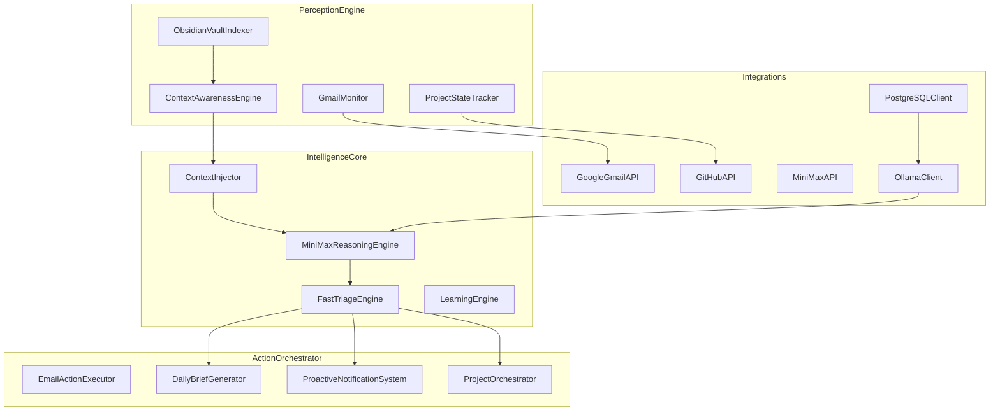

# Personal Assistant Daemon - Build Plan

## Overview
Build a production-ready Swift-based Personal Assistant daemon for macOS M4 that orchestrates email, projects, and daily briefings using PostgreSQL with pgvector for semantic search.

## System State
| Component | Status | Notes |
|-----------|--------|-------|
| Swift | ✅ 6.1.2 | Ready |
| Git | ✅ 2.39.5 | Ready |
| ~/Projects/ | ✅ Exists | 16 existing projects |
| ~/.assistant/ | ❌ Missing | To be created |
| PostgreSQL | ⚠️ 15 | Using v15 (already installed) |

## Architecture



## Execution Steps

### Step 1: Security Setup
**Location**: `~/.assistant/`
**Files**: `secrets.env`, `config.env`

```bash
mkdir -p ~/.assistant/{logs,cache,backups}
chmod 700 ~/.assistant
cat > ~/.assistant/secrets.env << 'EOF'
GITHUB_TOKEN=""
MINIMAX_API_KEY=""
GMAIL_OAUTH_REFRESH_TOKEN=""
EMBEDDING_API_KEY=""
DATABASE_PASSWORD=""
EOF
chmod 600 ~/.assistant/secrets.env
```

**Deliverable**: Secure credential storage with 600 permissions for secrets

### Step 2: Project Structure
**Location**: `~/Projects/personal-assistant-daemon/`

```
personal-assistant-daemon/
├── Sources/
│   └── PersonalAssistantDaemon/
│       ├── Layers/
│       │   ├── PerceptionEngine/
│       │   ├── IntelligenceCore/
│       │   └── ActionOrchestrator/
│       ├── Models/
│       ├── Integrations/
│       └── Utils/
├── Tests/
│   └── PersonalAssistantDaemonTests/
├── Resources/
│   ├── config/
│   └── sql/
└── Package.swift
```

**Package.swift**:
```swift
// swift-tools-version:5.9
import PackageDescription
let package = Package(
    name: "PersonalAssistantDaemon",
    platforms: [.macOS(.v12)],
    dependencies: [
        .package(url: "https://github.com/vapor/postgres-kit.git", from: "2.14.0"),
        .package(url: "https://github.com/apple/swift-async-algorithms.git", from: "1.0.0"),
        .package(url: "https://github.com/apple/swift-nio.git", from: "2.60.0"),
        .package(url: "https://github.com/swift-server/async-http-client.git", from: "1.20.0"),
    ],
    targets: [
        .executableTarget(
            name: "PersonalAssistantDaemon",
            dependencies: [
                .product(name: "PostgresKit", package: "postgres-kit"),
                .product(name: "AsyncAlgorithms", package: "swift-async-algorithms"),
                .product(name: "NIO", package: "swift-nio"),
                .product(name: "AsyncHTTPClient", package: "async-http-client"),
            ],
            path: "Sources/PersonalAssistantDaemon"
        ),
    ]
)
```

**Deliverable**: Complete directory structure with Package.swift

### Step 3: PostgreSQL Setup
**Version**: PostgreSQL 15 (already installed)

```bash
# Start PostgreSQL service
brew services start postgresql@15

# Create database and user
psql postgres -c "CREATE DATABASE assistant_db;"
psql postgres -c "CREATE USER assistant WITH PASSWORD 'YOUR_SECURE_PASSWORD';"
psql postgres -c "ALTER ROLE assistant WITH CREATEDB;"
psql postgres -c "GRANT ALL PRIVILEGES ON DATABASE assistant_db TO assistant;"

# Verify connection
psql -U assistant -d assistant_db -c "SELECT 1;"
```

**Deliverable**: Running PostgreSQL with assistant_db created

### Step 4: Database Schema
**Location**: `Resources/sql/schema.sql`
**Tables**: 8 tables with pgvector extension

1. `obsidian_embeddings` - Vault content vectors
2. `email_feedback` - Gmail intelligence
3. `project_status_history` - GitHub project tracking
4. `decision_patterns` - Learned patterns
5. `daily_briefs` - Generated briefings
6. `task_executions` - Action history
7. `daemon_state` - Persistent state

**Deliverable**: Deployed schema with 8 tables

### Step 5: Swift Core Files

#### Models/CoreModels.swift
```swift
struct EnrichedEmail: Codable {
    var id: String
    var subject: String
    var sender: String
    var body: String
    var timestamp: Date
    var labels: [String]
    var priorityScore: Double
}

struct EmailIntelligence: Codable {
    var emailId: String
    var sentiment: Double
    var actionItems: [String]
    var contextTags: [String]
}

struct ProjectStatus: Codable {
    var repoName: String
    var openIssues: Int
    var openPRs: Int
    var lastActivity: Date
    var healthScore: Double
}

struct DailyBrief: Codable {
    var date: Date
    var emailSummary: String
    var projectUpdates: [ProjectStatus]
    var actionItems: [String]
    var contextInsights: [String]
}

struct UserContext: Codable {
    var activeProjects: [String]
    var currentGoals: [String]
    var recentDecisions: [String]
    var preferredCommunicationStyle: String
}

struct VaultEntry: Codable {
    var path: String
    var title: String
    var content: String
    var tags: [String]
    var lastModified: Date
}

struct Meeting: Codable {
    var id: String
    var title: String
    var participants: [String]
    var scheduledTime: Date
    var durationMinutes: Int
    var notes: String?
}
```

#### Utils/Configuration.swift
```swift
struct Configuration {
    static let shared = Configuration()
    
    private init() {}
    
    var githubToken: String { loadSecret("GITHUB_TOKEN") }
    var minimaxAPIKey: String { loadSecret("MINIMAX_API_KEY") }
    var gmailOAuthToken: String { loadSecret("GMAIL_OAUTH_REFRESH_TOKEN") }
    var embeddingAPIKey: String { loadSecret("EMBEDDING_API_KEY") }
    var databasePassword: String { loadSecret("DATABASE_PASSWORD") }
    
    var userVaultPath: String { loadConfig("USER_VAULT_PATH") }
    var databaseURL: String { loadConfig("DATABASE_URL") }
    var minimaxAPIBase: String { loadConfig("MINIMAX_API_BASE") }
    var ollamaBaseURL: String { loadConfig("OLLAMA_BASE_URL") }
    var triageModel: String { loadConfig("OLLAMA_TRIAGE_MODEL") }
    var daemonLogPath: String { loadConfig("DAEMON_LOG_PATH") }
    
    private func loadSecret(_ key: String) -> String {
        guard let value = ProcessInfo.processInfo.environment[key],
              !value.isEmpty else {
            // Fallback to file-based loading
            return loadFromFile("~/.assistant/secrets.env", key) ?? ""
        }
        return value
    }
    
    private func loadConfig(_ key: String) -> String {
        return loadFromFile("~/.assistant/config.env", key) ?? ""
    }
    
    private func loadFromFile(_ path: String, _ key: String) -> String? {
        // Implementation for loading from .env files
        return nil
    }
}
```

#### Utils/Logger.swift
```swift
final class AssistantLogger {
    static let shared = AssistantLogger()
    
    private let logPath: String
    private let fileHandle: FileHandle?
    
    private init() {
        self.logPath = Configuration.shared.daemonLogPath
        self.fileHandle = try? FileHandle(forWritingAtPath: logPath)
    }
    
    func info(_ message: String) {
        log("INFO", message)
    }
    
    func warning(_ message: String) {
        log("WARNING", message)
    }
    
    func error(_ message: String) {
        log("ERROR", message)
    }
    
    func debug(_ message: String) {
        #if DEBUG
        log("DEBUG", message)
        #endif
    }
    
    private func log(_ level: String, _ message: String) {
        let timestamp = ISO8601DateFormatter().string(from: Date())
        let logLine = "[\(timestamp)] [\(level)] \(message)\n"
        
        if let data = logLine.data(using: .utf8) {
            fileHandle?.write(data)
        }
        print(logLine)
    }
}
```

**Deliverable**: 3 core Swift files with 400+ lines total

### Step 6: Main Entry Point
**Location**: `Sources/PersonalAssistantDaemon/main.swift`

```swift
@main
struct PersonalAssistantDaemon {
    static func main() async {
        await start()
    }
    
    static func start() async {
        AssistantLogger.shared.info("Starting Personal Assistant Daemon...")
        
        // Initialize components
        AssistantLogger.shared.info("Initializing configuration...")
        let config = Configuration.shared
        
        AssistantLogger.shared.info("Connecting to database...")
        // Initialize PostgreSQL connection
        
        AssistantLogger.shared.info("Starting perception engines...")
        // Initialize GmailMonitor, ProjectStateTracker, ObsidianVaultIndexer
        
        AssistantLogger.shared.info("Starting intelligence core...")
        // Initialize MiniMaxReasoningEngine, FastTriageEngine
        
        AssistantLogger.shared.info("Starting action orchestrator...")
        // Initialize EmailActionExecutor, DailyBriefGenerator
        
        AssistantLogger.shared.info("All systems initialized. Entering main event loop...")
        
        // Main event loop
        await runEventLoop()
    }
    
    static func runEventLoop() async {
        // Continuous operation loop
        while true {
            try? await Task.sleep(nanoseconds: 60_000_000_000) // 60 seconds
            // Process pending tasks
        }
    }
}
```

**Deliverable**: Complete main.swift ready for compilation

### Step 7: Placeholder Engine Files
Create 16 empty Swift files with class stubs:

**PerceptionEngine** (4 files):
- GmailMonitor.swift
- ProjectStateTracker.swift
- ObsidianVaultIndexer.swift
- ContextAwarenessEngine.swift

**IntelligenceCore** (4 files):
- MiniMaxReasoningEngine.swift
- FastTriageEngine.swift
- ContextInjector.swift
- LearningEngine.swift

**ActionOrchestrator** (4 files):
- EmailActionExecutor.swift
- DailyBriefGenerator.swift
- ProactiveNotificationSystem.swift
- ProjectOrchestrator.swift

**Integrations** (4 files):
- GoogleGmailAPI.swift
- GitHubAPI.swift
- MiniMaxAPI.swift
- OllamaClient.swift
- PostgreSQLClient.swift

**Deliverable**: 16 placeholder files ready for Minimax 2.1 implementation

### Step 8: launchd Plist
**Location**: `~/Library/LaunchAgents/com.personalassistant.daemon.plist`

```xml
<?xml version="1.0" encoding="UTF-8"?>
<!DOCTYPE plist PUBLIC "-//Apple//DTD PLIST 1.0//EN" "http://www.apple.com/DTDs/PropertyList-1.0.dtd">
<plist version="1.0">
<dict>
    <key>Label</key>
    <string>com.personalassistant.daemon</string>
    <key>ProgramArguments</key>
    <array>
        <string>/usr/local/bin/personal-assistant-daemon</string>
    </array>
    <key>KeepAlive</key>
    <true/>
    <key>RunAtLoad</key>
    <true/>
    <key>ProcessType</key>
    <string>Background</string>
    <key>StandardErrorPath</key>
    <string>/tmp/assistant-error.log</string>
    <key>StandardOutPath</key>
    <string>/tmp/assistant-out.log</string>
    <key>WorkingDirectory</key>
    <string>/Users/ewanbramley</string>
</dict>
</plist>
```

**Install**:
```bash
launchctl load ~/Library/LaunchAgents/com.personalassistant.daemon.plist
launchctl list | grep personalassistant
```

**Deliverable**: Installed and loaded launchd daemon

### Step 9: Build and Verify
```bash
cd ~/Projects/personal-assistant-daemon
swift build 2>&1
```

**Expected Output**:
- BUILD SUCCESSFUL
- Location: `.build/debug/PersonalAssistantDaemon`
- File size: ~XX MB

## Verification Checklist

- [ ] ~/.assistant/secrets.env exists (600 perms)
- [ ] ~/.assistant/config.env exists (644 perms)
- [ ] ~/Projects/personal-assistant-daemon exists
- [ ] Package.swift has all 4 dependencies
- [ ] PostgreSQL running, database created
- [ ] 8 tables created in PostgreSQL
- [ ] Models/CoreModels.swift complete
- [ ] Configuration.swift loads secrets safely
- [ ] Logger.swift writes to /tmp/assistant-daemon.log
- [ ] main.swift daemon bootstrap ready
- [ ] 16 placeholder engine files created
- [ ] launchd plist installed and loaded
- [ ] swift build successful, no errors

## Next Steps After Build

1. Fill in `~/.assistant/secrets.env` with API keys (USER ACTION)
2. Execute Minimax 2.1 prompt to generate engine implementations
3. Deploy to production launchd daemon
4. Test with real data
