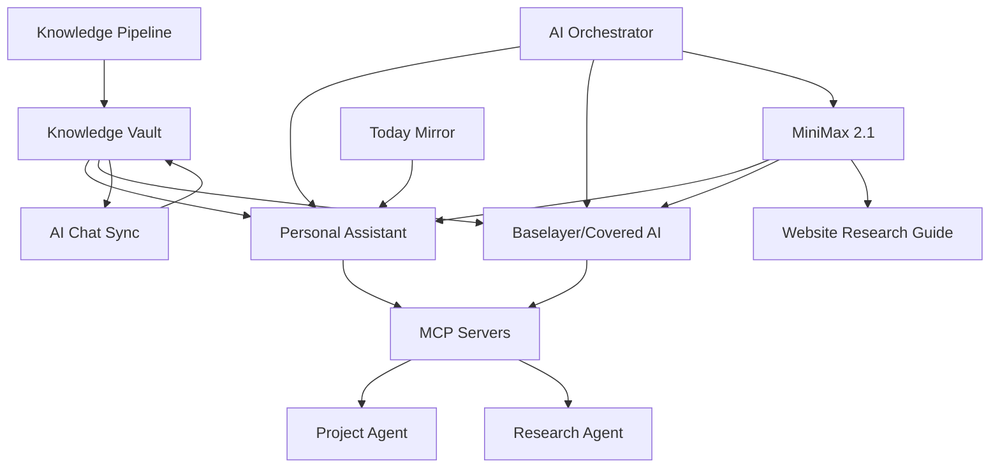

# Project Integration & MiniMax Research Plan

**Created:** 2026-01-12  
**Status:** Planning Phase  
**Goal:** Connect all workspace projects with Knowledge vault and research MiniMax 2.1 for world-class website development

---

## Executive Summary

This plan audits all existing projects, establishes cross-references with the Knowledge vault, and creates a comprehensive research framework for using MiniMax 2.1 LLM to build world-class websites.

---

## Discovered Projects Inventory

### 1. **Personal Assistant (Multi-Modal)**
- **Location:** [`PROJECT_SUMMARY.md`](../PROJECT_SUMMARY.md), [`MASTER_SPEC.md`](../MASTER_SPEC.md)
- **Purpose:** Comprehensive AI-powered personal assistant
- **Components:** Email, Tasks, Coaching, Telephone, Second Brain
- **Tech Stack:** Next.js, Node.js, PostgreSQL, Local LLMs (Ollama)
- **Status:** Planning complete, ready for implementation (Phase 1)
- **LLM Strategy:** 80% local (qwen2.5, llama3.2), 20% cloud (Claude, GPT-4)

### 2. **AI Chat Sync**
- **Location:** [`ai-chat-sync/`](../ai-chat-sync/)
- **Purpose:** Sync conversations from ChatGPT, Claude, Perplexity
- **Tech Stack:** Node.js, TypeScript, Puppeteer
- **Status:** Implemented
- **Integration Points:** Knowledge vault (conversation exports)

### 3. **Baselayer / Covered AI v2**
- **Location:** [`Baselayer/covered-ai-v2/`](../Baselayer/covered-ai-v2/)
- **Purpose:** AI-powered SaaS for insurance agents
- **Tech Stack:** Next.js, Python, PostgreSQL, Railway
- **Features:** Website builder, photo studio, email automation
- **Status:** Implementation complete (see [`IMPLEMENTATION-COMPLETE.md`](../Baselayer/covered-ai-v2/IMPLEMENTATION-COMPLETE.md))

### 4. **Knowledge System**
- **Location:** [`Knowledge/`](../Knowledge/)
- **Purpose:** Obsidian-based knowledge vault with atomic notes
- **Structure:** Sources → Atoms → Maps → Projects
- **Content:** 1,043 source files (458 transcripts, 93 ChatGPT exports, 492 business docs, 25 Claude skills)
- **Status:** Structure complete, processing needed

### 5. **Knowledge Pipeline**
- **Location:** [`knowledge_pipeline/`](../knowledge_pipeline/)
- **Purpose:** Automate processing of sources into atomic notes
- **Status:** Unknown (needs investigation)

### 6. **Kilo-Code MCP Servers**
- **Location:** [`Kilo-Code/MCP/`](../Kilo-Code/MCP/)
- **Purpose:** Model Context Protocol servers
- **Available Servers:** 
  - `project-agent` (run commands, analyze projects, manage tasks)
  - `research-agent` (validate product ideas, research platforms)
- **Status:** Operational

### 7. **Invoice Service**
- **Location:** [`invoice-service/`](../invoice-service/)
- **Purpose:** Invoice processing API with categorization
- **Tech Stack:** Python, Flask
- **Status:** Unknown (needs investigation)

### 8. **Today Mirror**
- **Location:** [`today-mirror/`](../today-mirror/)
- **Purpose:** Daily task tracking app
- **Tech Stack:** Swift (macOS native)
- **Status:** Unknown (needs investigation)

### 9. **Studio Dev**
- **Location:** [`studio-dev/`](../studio-dev/)
- **Purpose:** Unknown (needs investigation)
- **Status:** Unknown

### 10. **AI Orchestrator**
- **Location:** [`ai-orchestrator/`](../ai-orchestrator/)
- **Purpose:** AI task orchestration system
- **Tech Stack:** Python
- **Status:** Unknown (needs investigation)

---

## MiniMax 2.1 Research Context

### Current Understanding

**From [`test-minimax-api.py`](../test-minimax-api.py):**
- Model: `minimax/minimax-m2.1`
- Access: Via OpenRouter API
- API Key: OPENROUTER_API_KEY required
- Capabilities: Chat completions (standard LLM interface)

### Research Questions

1. **Technical Capabilities**
   - What makes MiniMax 2.1 unique vs Claude/GPT-4?
   - What are its strengths for website development?
   - What are token limits, cost structure, response speed?

2. **Website Development Use Cases**
   - Can it generate clean, semantic HTML/CSS?
   - Does it understand modern frameworks (React, Vue, Next.js)?
   - How well does it handle:
     - Accessibility (WCAG compliance)?
     - Responsive design?
     - Performance optimization?
     - SEO best practices?

3. **Integration Potential**
   - How to integrate with existing projects?
   - Can it power the Baselayer website builder?
   - Could it enhance the Personal Assistant's AI capabilities?

4. **Cost-Benefit Analysis**
   - How does it compare to current LLM stack?
   - When to use MiniMax vs local models vs Claude/GPT-4?

---

## Integration Architecture

---

## Deliverables

### 1. Project Audit Document
**File:** `PROJECT_INVENTORY.md`

Contents:
- Complete project descriptions
- Tech stack for each
- Current status assessment
- Key files and entry points
- Integration opportunities

### 2. Cross-Reference Map
**File:** `CROSS_REFERENCE_MAP.md`

Contents:
- How projects relate to each other
- Shared dependencies
- Data flow between systems
- Knowledge vault integration points

### 3. MiniMax Research Guide
**File:** `MINIMAX_WEBSITE_DEVELOPMENT_GUIDE.md`

Contents:
- MiniMax 2.1 capabilities overview
- Website development best practices
- Code generation strategies
- Comparison with other LLMs
- Integration patterns
- Cost optimization techniques
- Example prompts and outputs

### 4. Knowledge Vault Integration Plan
**File:** `Knowledge/03-maps/PROJECT_INTEGRATION_HUB.md`

Contents:
- Links to all project documentation
- Cross-cutting concerns
- Shared learnings and patterns
- Technology decision records

---

## Implementation Steps

### Phase 1: Audit & Documentation
1. Read README/docs for each project
2. Identify tech stacks and dependencies
3. Document current status
4. Create project inventory

### Phase 2: Relationship Mapping
1. Identify data flows between projects
2. Map shared technologies
3. Find integration opportunities
4. Document in cross-reference map

### Phase 3: Knowledge Vault Integration
1. Create hub note in Knowledge/03-maps
2. Link to existing project docs
3. Extract key learnings to atomic notes
4. Establish bidirectional links

### Phase 4: MiniMax Research
1. Test MiniMax 2.1 API thoroughly
2. Compare with Claude/GPT-4 on website tasks
3. Document strengths and weaknesses
4. Create prompt library
5. Write comprehensive guide

### Phase 5: Integration Recommendations
1. Identify where MiniMax adds value
2. Propose integration points
3. Estimate implementation effort
4. Create migration/adoption plan

---

## Success Criteria

- ✅ All projects documented with clear descriptions
- ✅ Cross-references established between related projects
- ✅ Knowledge vault has centralized project hub
- ✅ MiniMax 2.1 capabilities thoroughly understood
- ✅ Website development guide created with examples
- ✅ Clear recommendations for MiniMax integration

---

## Risks & Mitigations

### Risk 1: Projects in Unknown State
**Mitigation:** Read code and run basic tests to assess functionality

### Risk 2: MiniMax API Limitations
**Mitigation:** Have fallback plans using existing LLM stack

### Risk 3: Over-Complexity in Integration
**Mitigation:** Focus on high-value, simple integrations first

### Risk 4: Knowledge Vault Becomes Messy
**Mitigation:** Follow Obsidian CLAUDE.md guidelines strictly

---

## Next Actions

Based on your approval of this plan, we'll proceed to execute the tasks in the todo list, creating all deliverable documents and establishing the integration framework.

**Note:** Some terms in your original request were unclear ("minimax to genic mode", "mini mouse 2"). I've interpreted these as:
- "MiniMax in generic mode" → Using MiniMax 2.1 for general website development
- "mini mouse 2" → MiniMax 2.1 model

If this interpretation is incorrect, please clarify and I'll adjust the plan accordingly.