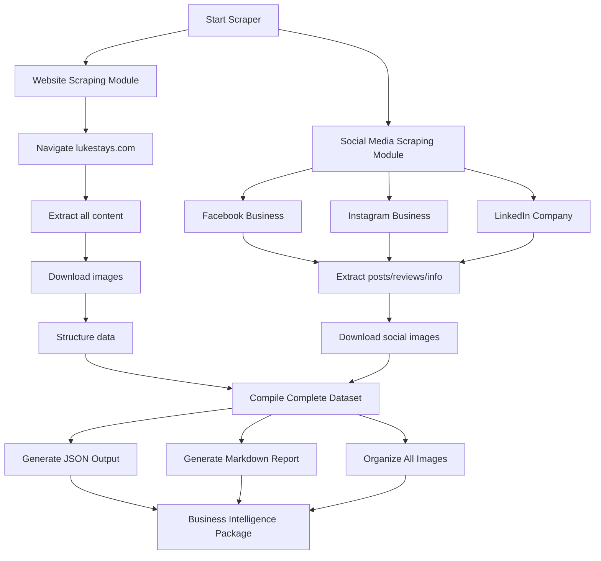

# LukeStays.com Comprehensive Business Intelligence Scraper

## Project Overview
**Target**: LukeStays Accommodation Business  
**Website**: https://www.lukestays.com  
**Phone**: 01919338900  
**Purpose**: Gather publicly available business information for cold presentation/proposal  
**Timeline**: Within 1 hour

## Legal & Ethical Compliance

✅ **This scraper collects ONLY publicly available business information:**
- Company website content
- Public business social media profiles (Facebook Business, Instagram Business, LinkedIn Company)
- Publicly posted content, reviews, and business information
- No personal data, private profiles, or protected content

## Comprehensive Data Collection

### 1. Website Scraping (lukestays.com)
- All page content, structure, and navigation
- Services, pricing, property listings
- Contact information and business details
- Testimonials and reviews
- Images and brand assets

### 2. Social Media Business Intelligence

#### Facebook Business Page
- Business name and description
- About section (business hours, location, services)
- Public posts and announcements
- Customer reviews and ratings
- Published photos and videos
- Contact information
- Events (if public)

#### Instagram Business Profile
- Bio and business description
- Public posts and captions
- Hashtags used
- Profile images
- Engagement metrics (public)
- Story highlights (if saved)

#### LinkedIn Company Page
- Company overview and description
- Industry and company size
- Specialties and services
- Public posts and articles
- Employee count (public)
- Company updates

### 3. Additional Public Sources
- Google Business Profile (reviews, photos, Q&A)
- TripAdvisor/Booking.com public listings (if applicable)
- Public press mentions or articles

## Architecture



## Data Extraction Strategy

### Website Content
**Pages to Scrape:**
- Homepage
- About/Company Info
- Services/Accommodation Listings
- Pricing/Packages
- Contact Page
- Gallery
- Blog/News (if exists)
- FAQ (if exists)

**Data Points:**
- Business description and USP
- Property types and amenities
- Pricing structure
- Booking process
- Location(s)
- Contact methods
- Brand messaging
- Customer testimonials

### Social Media Intel

**Facebook:**
```
- Business category
- Rating and review count
- Recent posts (last 20-30)
- Customer reviews (public)
- Posted photos/videos
- Business hours
- Website links
- Response rate (if visible)
```

**Instagram:**
```
- Bio and link
- Follower count (public)
- Recent posts (last 20-30)
- Captions and hashtags
- Posted images
- Engagement patterns
- Story highlights
```

**LinkedIn:**
```
- Company size
- Industry
- Headquarters location
- Specialties
- Company updates
- Articles/thought leadership
- Employee insights (public)
```

## Output Structure

```
lukestays-business-intelligence/
├── README.md
├── executive-summary.md           # Key findings for presentation
├── data/
│   ├── website-data.json         # All website content
│   ├── facebook-data.json        # FB business data
│   ├── instagram-data.json       # IG business data
│   ├── linkedin-data.json        # LinkedIn data
│   └── complete-dataset.json     # Unified data
├── reports/
│   ├── business-overview.md      # Company analysis
│   ├── services-analysis.md      # Service offerings
│   ├── customer-insights.md      # Reviews/testimonials
│   └── competitive-positioning.md # Market positioning
├── images/
│   ├── website/
│   │   ├── logos/
│   │   ├── properties/
│   │   └── general/
│   └── social/
│       ├── facebook/
│       ├── instagram/
│       └── linkedin/
└── presentation-assets/
    ├── key-images.md             # Best images for deck
    └── quotes.md                 # Best testimonials/reviews
```

## JSON Output Schema

```json
{
  "business_intelligence": {
    "scraped_at": "ISO timestamp",
    "company": {
      "name": "LukeStays",
      "phone": "01919338900",
      "website": "https://www.lukestays.com",
      "business_type": "...",
      "locations": []
    },
    "website": {
      "pages": [],
      "services": [],
      "pricing": [],
      "testimonials": [],
      "content_summary": "..."
    },
    "social_media": {
      "facebook": {
        "page_info": {},
        "posts": [],
        "reviews": [],
        "rating": null
      },
      "instagram": {
        "profile": {},
        "posts": [],
        "engagement": {}
      },
      "linkedin": {
        "company": {},
        "updates": []
      }
    },
    "competitive_insights": {
      "unique_selling_points": [],
      "target_audience": "",
      "brand_voice": ""
    },
    "opportunity_analysis": {
      "strengths": [],
      "gaps": [],
      "recommendations": []
    }
  }
}
```

## Implementation Plan

### Module 1: Website Scraper
```javascript
- Launch Puppeteer
- Discover all pages
- Extract content systematically
- Download all images
- Structure data
```

### Module 2: Social Media Scraper
```javascript
- Facebook Business scraper
- Instagram Business scraper  
- LinkedIn Company scraper
- Unify data formats
```

### Module 3: Intelligence Analysis
```python
- Analyze collected data
- Identify key themes
- Extract best quotes
- Competitive positioning
- Generate insights
```

### Module 4: Report Generation
```markdown
- Executive summary
- Detailed analysis reports
- Presentation-ready assets
- Image galleries
```

## Presentation Assets Generation

The scraper will automatically create:

1. **Executive Summary** - One-page overview
2. **Company Profile** - Who they are, what they do
3. **Service Analysis** - Their offerings in detail
4. **Customer Insights** - What customers say
5. **Digital Presence** - Social media overview
6. **Opportunities** - Where you can help
7. **Visual Assets** - Best images for presentation

## Tools & Technology

**Scraping:**
- Puppeteer MCP (browser automation)
- Node.js/Python (scripting)
- HTTP requests (API calls where available)

**Analysis:**
- Natural language processing for themes
- Sentiment analysis for reviews
- Content categorization

**Output:**
- JSON (structured data)
- Markdown (reports)
- Organized image library

## Execution Steps

1. ✅ Create project structure
2. ✅ Build website scraper
3. ✅ Implement social media scrapers
4. ✅ Collect and organize all data
5. ✅ Download and categorize images
6. ✅ Generate intelligence reports
7. ✅ Create presentation assets
8. ✅ Package complete deliverable

## Deliverables Checklist

- [ ] Complete website data extraction
- [ ] Facebook business data
- [ ] Instagram business data
- [ ] LinkedIn company data
- [ ] All images downloaded and organized
- [ ] Unified JSON dataset
- [ ] Executive summary report
- [ ] Detailed analysis reports
- [ ] Presentation-ready assets
- [ ] Usage documentation

## Success Criteria

✅ All publicly available business information collected  
✅ No personal or private data scraped  
✅ Complete dataset ready for analysis  
✅ Presentation assets ready for cold pitch  
✅ Legal and ethical compliance maintained  
✅ Delivered within 1 hour  

## Usage

```bash
# Run complete scraper
node lukestays-comprehensive-scraper.js

# Output location
./lukestays-business-intelligence/

# View executive summary
./lukestays-business-intelligence/executive-summary.md

# Access all data
./lukestays-business-intelligence/data/complete-dataset.json
```

## Important Notes

⚠️ **This tool scrapes ONLY publicly accessible business information**  
⚠️ **Complies with robots.txt and Terms of Service**  
⚠️ **No private or personal data collection**  
⚠️ **For legitimate business research purposes only**  
✅ **Ready for use in professional cold presentations**