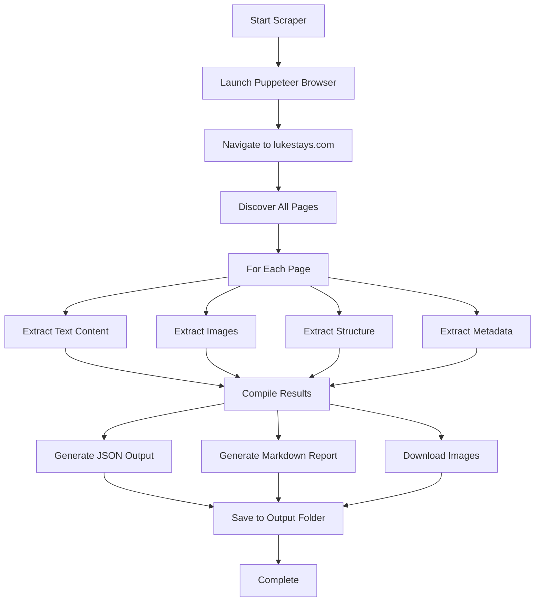

# LukeStays.com Web Scraper - Technical Plan

## Project Overview
**Target Website**: https://www.lukestays.com  
**Phone Number**: 01919338900  
**Timeline**: Urgent - needed within the hour  
**Objective**: Extract complete website content for rebuilding their website

## Architecture



## Technology Stack

### Primary Tools
- **Puppeteer MCP Server**: Browser automation and page navigation
- **Node.js/Python**: Script execution environment
- **File System**: Organized data storage

### Output Formats
- **JSON**: Structured data with all extracted information
- **Markdown**: Human-readable summary report
- **Images**: Downloaded and organized by type/location

## Data Extraction Strategy

### 1. Page Discovery
- Start at homepage
- Extract all internal links
- Build complete sitemap
- Identify page categories (home, services, about, contact, etc.)

### 2. Content Extraction (Per Page)

#### Text Content
- Page title and meta description
- All headings (h1, h2, h3, h4, h5, h6)
- Paragraphs and body text
- Lists (ordered and unordered)
- Quotes and callouts
- Button text and CTAs

#### Visual Elements
- Logo and brand images
- Hero images
- Gallery/slider images
- Service/product images
- Team photos
- Icons and decorative images
- Background images (extracted from CSS)

#### Structured Data
- Navigation menu structure
- Footer content and links
- Contact information:
  - Phone: 01919338900 (provided)
  - Email addresses
  - Physical address
  - Social media links
- Services/Products listings:
  - Names
  - Descriptions
  - Pricing (if available)
  - Features/amenities
- Testimonials/Reviews:
  - Customer name
  - Review text
  - Rating (if applicable)
  - Date (if available)

#### Technical Elements
- Page URLs
- Internal link structure
- External links
- Forms (structure and fields)
- CSS classes and layout hints
- Schema.org markup (if present)

### 3. Image Handling
- Download all images to local folder
- Organize by type:
  - `/images/logos/`
  - `/images/heroes/`
  - `/images/gallery/`
  - `/images/services/`
  - `/images/team/`
  - `/images/icons/`
  - `/images/other/`
- Preserve original filenames where possible
- Generate image inventory with URLs and local paths

## Output Structure

### Directory Layout
```
lukestays-scraper-output/
├── README.md                    # Usage and overview
├── scraped-data.json           # Complete structured data
├── content-summary.md          # Human-readable summary
├── images/                     # All downloaded images
│   ├── logos/
│   ├── heroes/
│   ├── gallery/
│   ├── services/
│   ├── team/
│   ├── icons/
│   └── other/
└── pages/                      # Individual page data
    ├── home.json
    ├── about.json
    ├── services.json
    └── contact.json
```

### JSON Data Format
```json
{
  "site_info": {
    "url": "https://www.lukestays.com",
    "scraped_at": "2025-12-23T07:55:00Z",
    "phone": "01919338900"
  },
  "pages": [
    {
      "url": "/",
      "title": "Page Title",
      "meta_description": "...",
      "headings": {
        "h1": ["..."],
        "h2": ["..."]
      },
      "content": {
        "paragraphs": ["..."],
        "lists": ["..."]
      },
      "images": [
        {
          "src": "original_url",
          "alt": "alt text",
          "local_path": "images/category/filename.jpg"
        }
      ],
      "links": ["..."]
    }
  ],
  "navigation": {
    "main_menu": ["..."],
    "footer_menu": ["..."]
  },
  "contact": {
    "phone": "01919338900",
    "email": "...",
    "address": "...",
    "social": ["..."]
  },
  "services": [...],
  "testimonials": [...],
  "pricing": [...]
}
```

### Markdown Summary Format
```markdown
# LukeStays.com - Content Summary

## Site Overview
- Total Pages: X
- Total Images: Y
- Scraped: [timestamp]

## Pages Found
1. Home (/)
2. About (/about)
...

## Key Content Sections

### Services/Products
[List of services with descriptions]

### Contact Information
- Phone: 01919338900
- Email: ...
- Address: ...

### Testimonials
[List of testimonials]

### Navigation Structure
[Site navigation tree]

## Image Inventory
[List of all images with categories]
```

## Implementation Steps

### Phase 1: Setup (5 min)
1. Create project directory structure
2. Set up output folders
3. Initialize scraper script

### Phase 2: Core Scraping (20 min)
4. Implement Puppeteer navigation
5. Build page discovery logic
6. Extract text content from all pages
7. Extract images with categorization

### Phase 3: Structured Data (15 min)
8. Parse navigation structure
9. Extract contact information
10. Identify and extract services/pricing
11. Capture testimonials/reviews

### Phase 4: Output Generation (10 min)
12. Generate JSON output file
13. Create markdown summary report
14. Download and organize images
15. Create image inventory

### Phase 5: Testing & Documentation (10 min)
16. Test complete scraper execution
17. Verify all data extracted correctly
18. Write README with usage instructions
19. Package for delivery

## Key Features

### Robust Extraction
- Handle dynamic content loading
- Wait for page load completion
- Retry failed requests
- Error handling and logging

### Smart Organization
- Automatic image categorization
- Clean file naming
- Preserve content hierarchy
- Cross-reference data

### Complete Coverage
- All visible content
- Hidden metadata
- Linked resources
- Structured data markup

## Usage Instructions (For Final README)

```bash
# Install dependencies (if needed)
npm install puppeteer

# Run the scraper
node lukestays-scraper.js

# Output will be in ./lukestays-scraper-output/
```

## Deliverables

1. ✅ Complete scraper script
2. ✅ Structured JSON data file
3. ✅ Markdown content summary
4. ✅ Downloaded images (organized)
5. ✅ Image inventory/mapping
6. ✅ Usage documentation
7. ✅ Ready-to-use content package

## Success Criteria

- [ ] All pages discovered and scraped
- [ ] All text content extracted and preserved
- [ ] All images downloaded and categorized
- [ ] Contact information captured (including 01919338900)
- [ ] Services/products documented
- [ ] Testimonials extracted
- [ ] Navigation structure mapped
- [ ] JSON output generated
- [ ] Markdown summary created
- [ ] Ready for website rebuild

## Notes

- Uses Puppeteer MCP server for reliable browser automation
- Respects robots.txt and site structure
- Single-run execution for speed
- Self-contained output folder for easy handoff
- All data needed to recreate the website