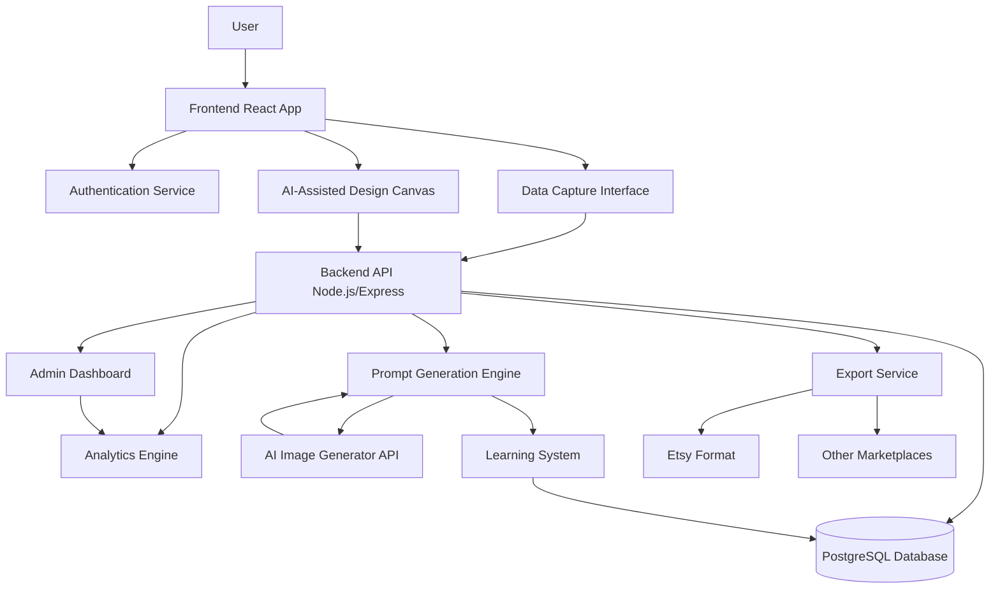

# Melanin-Focused Design Platform - Architecture Plan

## System Overview

A web application that helps users create unique, melanin-focused digital products through AI-assisted design, learning from user interactions to improve prompt generation over time.

## System Architecture



## Core Components

### 1. Frontend (React + TypeScript)
- **User Interface**: Clean, intuitive design for style/color/theme input
- **Design Canvas**: Interactive workspace where users arrange design elements
- **Real-time Preview**: Show how design choices affect final output
- **Feedback Interface**: Users rate/refine generated designs

### 2. Backend (Node.js + Express)
- **RESTful API**: Handle all data operations
- **Prompt Engine**: Convert design choices into AI prompts
- **Learning System**: Store successful patterns and user preferences
- **Export Pipeline**: Format designs for different marketplaces

### 3. Database (PostgreSQL)
```
Users
- id, email, profile_data, created_at

DesignPreferences
- id, user_id, style, colors, themes, cultural_elements

DesignSessions
- id, user_id, preferences, canvas_state, created_at

GeneratedPrompts
- id, session_id, prompt_text, ai_response, user_rating, success_score

DesignOutputs
- id, prompt_id, image_url, marketplace_formats, export_data
```

### 4. AI Integration
- Connect to OpenAI DALL-E, Midjourney, or similar API
- Translate design choices into detailed prompts
- Store prompt effectiveness data for learning

### 5. Learning Loop
- Track which preference combinations generate best results
- Monitor user ratings and refinements
- Improve prompt generation over time
- Build pattern library of successful melanin-focused designs

## Key Features

### Data Collection Interface
- Style selection (modern, traditional, abstract, etc.)
- Color palette builder for melanin skin tones
- Theme categories (cultural celebrations, daily life, abstract art)
- Custom text/quotes input
- Cultural symbols/motifs library

### AI-Assisted Design Canvas
- Drag-and-drop design elements
- Layer management
- Color adjustment tools
- AI suggestions based on preferences
- Real-time prompt preview

### Prompt Generation
```javascript
// Example prompt structure
{
  baseStyle: "user.stylePreference",
  colorPalette: "warm browns, rich golds, deep mahoganies",
  theme: "celebration of Black culture",
  elements: ["geometric patterns", "natural hair textures"],
  marketplaceFormat: "wrapping paper, seamless pattern",
  culturalContext: "Afrocentric, modern aesthetic"
}
```

### Export Functionality
- Etsy-ready formats (specific dimensions, DPI requirements)
- Print-on-demand specifications
- Multiple product type templates (mugs, t-shirts, posters)
- Batch export for product variations

### Admin Dashboard
- Monitor prompt success rates
- View trending design preferences
- Analyze which combinations work best
- Track user engagement metrics
- Identify improvement opportunities

## Technology Stack Recommendations

### Frontend
- **React** with TypeScript for type safety
- **Tailwind CSS** for rapid UI development
- **Canvas API** or **Fabric.js** for design canvas
- **React Query** for data fetching
- **Zustand** for state management

### Backend
- **Node.js** with Express
- **TypeScript** for consistency
- **Prisma ORM** for database operations
- **JWT** for authentication
- **Redis** for caching prompt patterns

### AI Integration
- **OpenAI API** (DALL-E 3) or **Replicate** (multiple models)
- **Prompt engineering library** for consistent results
- **Image processing** with Sharp.js

### Infrastructure
- **Vercel** or **Railway** for deployment
- **PostgreSQL** on Supabase or Railway
- **AWS S3** for image storage
- **Cloudflare** for CDN

## Implementation Phases

### Phase 1: Foundation
- Set up project structure
- Implement authentication
- Create database schema
- Build basic API endpoints

### Phase 2: Data Collection
- Build preference input interface
- Create user profile management
- Implement data validation and storage

### Phase 3: Design Canvas
- Create interactive design workspace
- Add element manipulation features
- Build real-time preview system

### Phase 4: AI Integration
- Connect to AI image generation API
- Build prompt generation engine
- Implement basic learning system

### Phase 5: Feedback & Learning
- Add rating/refinement interface
- Build analytics for prompt effectiveness
- Create pattern recognition system

### Phase 6: Export & Deployment
- Implement marketplace format exports
- Build admin dashboard
- Deploy to production
- Set up monitoring

## Critical Success Factors

1. **User Experience**: Interface must be intuitive for non-technical users
2. **Prompt Quality**: Generated prompts must consistently produce good results
3. **Learning System**: Platform improves over time by analyzing successful patterns
4. **Performance**: Fast response times for AI generation
5. **Cultural Authenticity**: Designs must resonate with target audience

## Next Steps

1. Review this architecture plan
2. Confirm tech stack choices
3. Clarify any missing requirements
4. Begin Phase 1 implementation