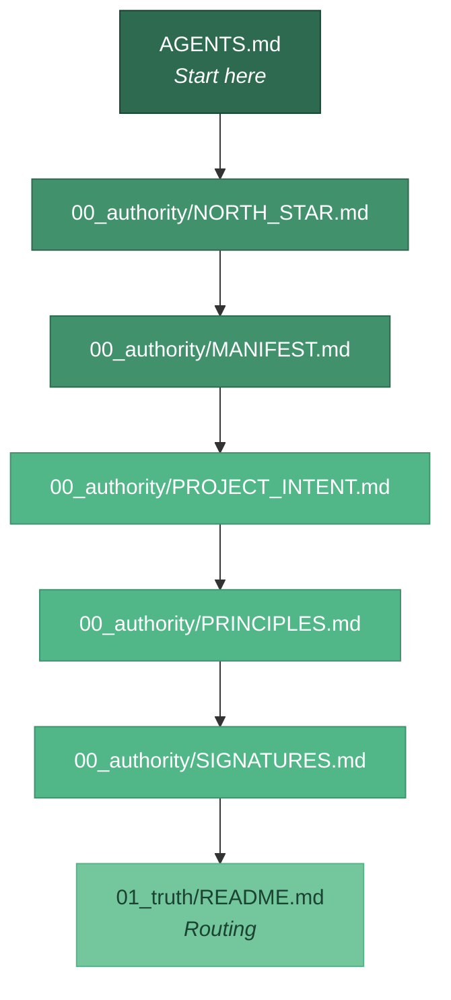

<div align="center">

# Clean Build Workspace

**The governed operating environment for Amplified Partners AI agents.**

[](https://github.com/Amplified-Partners/clean-build/tree/main/00_authority)
[](https://github.com/Amplified-Partners/the-amplified-method)

*Part of [Amplified Partners](https://github.com/Amplified-Partners) · [The Method](https://github.com/Amplified-Partners/the-amplified-method)*

</div>

---

## What this is (for humans)

This is the operating rulebook for AI agents working within Amplified Partners. It defines what agents may do, how they make decisions, how they escalate, and what they must sign. Think of it as the governance layer — the equivalent of a company's operating procedures, written for AI rather than people.

**If you're looking for the methodology** (why we work this way, the compound engineering loop, the agent ecosystem), see [The Amplified Partners Method](https://github.com/Amplified-Partners/the-amplified-method).

**If you're looking for the product** (what Amplified Partners builds for small businesses), see [amplifiedpartners.ai](https://www.amplifiedpartners.ai).

```
00_authority/   Policy spine — principles, north star, decision log, signatures
01_truth/       Truth-shaped candidates — schemas, interfaces, SOPs
02_build/       Runnable artifacts — code, scripts, infrastructure
03_shadow/      Experiments, wrap-ups, Kaizen probes (never authoritative)
90_archive/     Reference and provenance (not current authority)
```

---

## Start here (agents)

**Canonical read order and autonomy bounds:** open **[`AGENTS.md`](AGENTS.md)** and
read **§ Agent session — first 60 seconds** first. Other pointers
below are secondary; they do not replace that section.

Then (same spine, more depth):

- [`00_authority/NORTH_STAR.md`](00_authority/NORTH_STAR.md) — file budget + default behaviour when uncertain
- [`00_authority/MANIFEST.md`](00_authority/MANIFEST.md) — authority index + GitHub slug rule (`YYYYMMDD-clean-build-amplified-partners` under `Amplified-Partners`)
- [`01_truth/README.md`](01_truth/README.md) — where processes / schemas / interfaces go



**GitHub (if / when a remote exists):** do not infer the remote name from this
folder alone — see `MANIFEST.md` § GitHub repository naming.

Current state: `02_build/` may remain intentionally sparse while authority,
process, and transfer foundations are being hardened.

---

<div align="center">

**Built by [Amplified Partners](https://www.amplifiedpartners.ai)**

Radical Honesty · Radical Transparency · Radical Attribution · Win-Win

</div>
